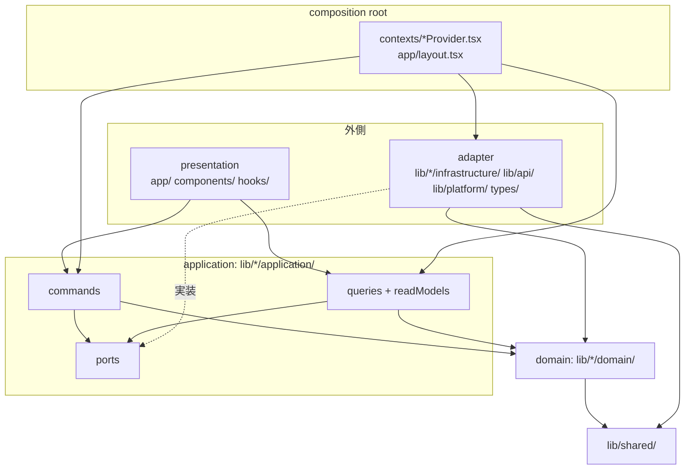
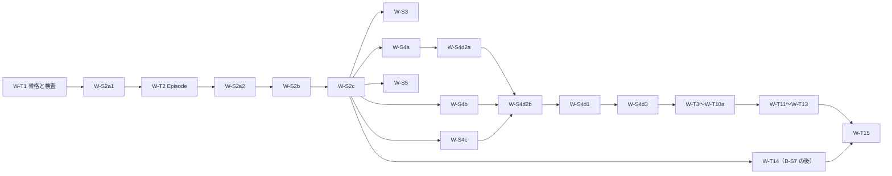

# news-listen-web Implementation Spec — 目標アーキテクチャ（層・3 つのモデル・command と query・依存の規則・検証・slice の全体）

日付: 2026-09-30 ／ mode: design（読み取り専用。実装は止めてある）／ owner: user ／ 決定の根拠: 親 docs [ADR-110](../../../docs/adr/110-refactor-target-domain-centered-onion-cqrs.md)（決定 1〜10）

## 1. 前書き

### 1.1 目的

web module の全 context について、リファクタが完了したときのコードの形を、実在の path と機械的に判定できる規則で定める。目的は user が 2026-09-30 に定めた 2 点である（ADR-110）。

1. ドメインモデル・リードモデル・データモデルが分かれ、カプセル化されている。
2. ドメインモデルを中心に置いた層構造と、command と query の分離により、変更しやすい。

用語（層・3 つのモデル・変換の置き場・command と query・receipt・カプセル化・AQ-1〜AQ-7）の定義は、親 docs [design/architecture.md](../../../docs/design/architecture.md) にある。本書は定義を書き直さず、節番号で参照する。

### 1.2 既存の Spec との関係

| 文書 | 正本として持つもの |
|---|---|
| 本書（2026-09-30） | 層と path の対応、3 つのモデルの対応、command と query の入口、依存の規則、検証の仕様、slice の全体と既存 order の補正 |
| [2026-09-16 の Spec](2026-09-16-implementation-spec-domain-model.md)（以下「既存 Spec」） | その範囲（再生・認証・設定・テストの土台）の状態遷移と契約の詳細: use case（UC-*）、遷移表、契約 CI-T1〜CI-T18、capsule CP1〜CP9、temporary path TP1〜TP3 |

同じ契約を 2 つの文書に書かない。本書は既存 Spec の契約を ID（`CI-T*`・`CP*`・`UC-*`・`SG-*`・`W-*`）で参照する。置き場（path）・型の所属・入口の分け方が食い違う場合は本書が優先し、既存 Spec の該当行は 2026-09-30 に補正済みである（既存 Spec の改訂履歴）。状態遷移と契約の期待値が食い違う場合は既存 Spec が優先する。

### 1.3 読む順

§3（層と path）→ §4（依存の規則）→ 担当する context の節（§5）→ §7（検証）→ §8（slice）。order を書く担当は §8.2・§8.3 から読み、契約 ID で §5 へ戻る。

### 1.4 状態と対象の revision

- 状態: design。実装と takt への投入は止めてある（親 docs [refactor plan](../../../docs/plan/2026-09-16-design-review-refactor.md)「実装の停止と再開ゲート」）。
- 対象: web `fbe76d12b042866a90659eab6247360832a86900`（`main` と同じ内容。追跡ファイルの差分なし）、親 docs `c7ae1c47` にブランチ `docs/2026-09-30-refactor-target-architecture` の変更を足したもの。
- 本書の「現状」は、2026-09-30 にこの revision の実コードを読んで確かめた。`path:行` はこの revision のもの。path は断らない限り `web/` 起点。
- 完了済みの slice: W-S0・W-0・W-S1・W-S1b・W-S2a。未着手: W-S2a1 以降の 13 本。

## 2. 要求と trace の入口

| 種別 | ID | 本書で応える節 |
|---|---|---|
| 品質要求（PRD §6） | NFR-09（変更容易性）・NFR-10（カプセル化） | §3・§4・§5・§7 |
| 品質 scenario（architecture.md §2） | AQ-1〜AQ-7 | §7 の各検査の「対応する AQ」 |
| 機能要件（PRD §5） | F-FEED-01・04・06・07・11、F-POD-01・05〜08・10、F-SET-01・02・04・06・07・08、F-ACC-01〜07、F-PKY-01〜03、F-LRN-01〜06・09〜11 | §5 の各 context（§9 の trace） |
| 学習仕様 | L-R01〜L-R21 | §5.6 |
| 共有仕様 | Q-01〜Q-33、RS-01〜RS-07、PS-01〜PS-13、SL-01〜SL-10 | §5.1・§5.3（期待値は共有仕様が正本。本書は変えない） |
| 決定 | ADR-101〜ADR-110、台帳 §5 の SG-*、§5.0 の W-1〜W-15 | §5・§10 |

本書は公開 API（backend の契約）と、利用者に見える挙動を変えない。変える必要がある事柄は §10.3 に判断として返す。

## 3. 層と実在の path

### 3.1 層とディレクトリ

TypeScript の import はディレクトリで判定できるので、層はディレクトリに対応させる。architecture.md §3 の「adapter」は、web では `infrastructure` という名前のディレクトリにする。

| 層 | path（目標） | 置くもの |
|---|---|---|
| shared kernel | `lib/shared/` | `Result`・`ApiFailure`（失敗の意味の型）・`DifficultyLevel`。どの層からも import できる。何にも依存しない |
| domain | `lib/<context>/domain/` | ドメインモデル。状態・遷移・不変条件・業務規則・検査つきの生成関数。domain が駆動する port の型（`AudioElement`） |
| application | `lib/<context>/application/` | use case。`commands.ts`・`queries.ts`・`readModels.ts`・`ports.ts`（ファイルが大きい use case は 1 ファイル 1 use case でよい） |
| adapter（context） | `lib/<context>/infrastructure/` | port の実装。通信・永続化のデータモデルと、domain / リードモデルへの変換 |
| adapter（共通） | `lib/api/`（`gateway.ts` と資源別の request 組立て）・`lib/platform/`（ブラウザの機能と、その技術 seam の型）・`types/index.ts`（通信のデータモデル = DTO） | 通信・ブラウザの共通部分 |
| adapter（端） | `app/api/backend/[...path]/route.ts`（BFF）・`public/sw.js`（Service Worker） | サーバー側と SW 側。どの層からも import されない |
| presentation | `app/**`（`app/api/**` と 2 つの layout を除く）・`components/**`・`hooks/**`・`lib/<context>/presentation/`・`lib/presentation/` | 画面・文言の写像・表示用の整形。application の command と query を呼ぶ |
| composition root | `contexts/**`・`app/layout.tsx`・`app/(app)/layout.tsx` | adapter を作って application に渡し、React の state に写す。業務の判断を持たない |



context は 8 つ: Playback・Catalog・Account・Preferences・Notifications・Learning・Admin・Platform（Platform は domain を持たない）。

### 3.2 現状 → 目標の対応

| 現状の path | 現状の役割 | 目標の path | 動かす slice |
|---|---|---|---|
| `lib/playback/{session,queue,resume,source}.ts` | domain（DTO を参照: §4 TA-D1） | `lib/playback/domain/` の同名ファイル | W-T1 |
| `lib/playback/ports.ts` | port の型 4 つ | `AudioElement` → `lib/playback/domain/audioElement.ts`。`CacheStore`・`CacheBucket`・`CacheWriteFailure` → `lib/platform/cacheStore.ts`。`KeyValueStore` → `lib/platform/keyValueStore.ts` | W-T1 |
| `lib/platform/{audioElement,cacheStore,keyValueStore}.ts` | adapter | そのまま（型の export を足す） | W-T1 |
| `lib/api/gateway.ts` の型 `Result`・`ApiFailure`（`:10-24`） | adapter が型の持ち主 | `lib/shared/{result,apiFailure}.ts`。`gateway.ts` は再 export（一時経路 TP-A2） | W-T1 |
| `lib/api/{admin,articles,auth,feed,health,notifications,podcasts,settings,users,vocabulary}.ts` | adapter（資源別の request 組立て） | そのまま | — |
| `lib/api.ts`・`lib/api/legacyRequest.ts` | TP1 | 削除 | W-S4d3 |
| `types/index.ts` | DTO と、domain の値域（`DifficultyLevel` `:3-13`・`UserRole`・`PushSubscriptionState`）が同居 | DTO 専用。値域は `lib/shared/difficulty.ts`・`lib/account/domain/role.ts`・`lib/notifications/domain/pushSubscriptionState.ts` へ。最後に `lib/api/dto.ts` へ改名 | W-T1（difficulty・role）・W-T9・W-T15 |
| `lib/account/adminAccess.ts` | domain | `lib/account/domain/adminAccess.ts` | W-T1 |
| `lib/push/pushRegistration.ts` | application | `lib/notifications/application/pushRegistration.ts` | W-T9 |
| `lib/pushBrowserPort.ts`・`lib/webauthnBrowserPort.ts` | port の型と実装が同じファイル | 型 → `lib/notifications/application/ports.ts`・`lib/account/application/ports.ts`。実装 → `lib/platform/{pushBrowser,webauthn}.ts` | W-T9 |
| `lib/passkey.ts` | application（DTO を引数に取る） | `lib/account/application/passkey.ts` | W-T6 |
| `lib/podcastPolling.ts` | domain（ポーリングの停止の純関数） | `lib/catalog/domain/generationWatch.ts` | W-T3 |
| `lib/podcastTitle.ts` | 表示用の題の規則（DTO の形を引数に取る） | `lib/catalog/domain/episode.ts` の `displayTitle`。旧ファイルは最後の利用が消えたら削除 | W-T2（新設）・W-T3（削除） |
| `lib/featuredCategories.ts` | 値域と日本語ラベルが同居 | 値域 → `lib/catalog/domain/featuredCategory.ts`。ラベル → `lib/catalog/presentation/featuredCategoryLabels.ts` | W-T5 |
| `lib/config.ts` | localStorage の key 名 | `lib/preferences/infrastructure/localSettingsStore.ts` と `lib/playback/infrastructure/localPositionStore.ts` へ吸収 | W-S4b・W-T15 |
| `lib/sfx.ts` | adapter（WebAudio）＋設定の読み書き | `lib/platform/sfx.ts`（設定は Preferences から関数で受ける） | W-T13 |
| `lib/swCacheCleanup.ts`・`lib/cookie.ts`・`lib/webpush.ts` | adapter の小道具 | `lib/platform/` の同名ファイル | W-T9 |
| `lib/reportClientError.ts` | adapter（`fetch` 直呼び `:22`） | `lib/platform/errorReporter.ts`（gateway 経由） | W-T10a |
| `lib/format.ts`・`lib/highlightTerms.tsx` | 表示用の整形 | `lib/presentation/` の同名ファイル | W-T15 |
| `lib/{audioCache,playbackQueue,playbackPosition,resolvePlayback}.ts`・`hooks/{useAudioPlayer,useStartPodcast}.ts`・`contexts/AudioPlayerContext.tsx` | 旧再生実装 | 削除 | W-S2c |
| `contexts/AppContext.tsx` | 設定の保持・永続化・raw `dispatch` | 削除（`contexts/PreferencesProvider.tsx`） | W-S4b |
| `contexts/AuthContext.tsx` | 認証の状態・use case・後始末・配線 | `contexts/AuthProvider.tsx`（配線だけ） | W-S4c・W-T6 |
| `contexts/StreakContext.tsx` | query・規則・効果音 | `contexts/StreakProvider.tsx`（配線だけ） | W-T13 |
| `contexts/ApiClientProvider.tsx` | composition | そのまま | — |
| `app/**` の page・`components/**`・`hooks/**` | presentation＋use case＋業務規則＋DTO の保持 | presentation だけ | W-S2b・W-S4a〜W-S4d3・W-T3〜W-T13 |

新しく作る path（既存 order と補完 slice が作るもの）は §5 の各 context の表に書く。

## 4. 依存の規則

量化に使う集合を先に定める。「現状」の集合は、目標のディレクトリがまだ無いので、§3.2 で対応するファイルで数える。

| 集合 | 目標の glob | 現状の対応ファイル |
|---|---|---|
| DOMAIN | `lib/*/domain/**` | `lib/playback/{session,queue,resume,source,ports}.ts`・`lib/account/adminAccess.ts` |
| APP | `lib/*/application/**` | `lib/push/pushRegistration.ts`・`lib/passkey.ts` |
| INFRA | `lib/*/infrastructure/**`・`lib/api/**`・`lib/platform/**`・`types/**`・`lib/config.ts` | 同左（`lib/*/infrastructure` はまだ無い） |
| PRES | `app/**`（`app/api/**`・`app/layout.tsx`・`app/(app)/layout.tsx` を除く）・`components/**`・`hooks/**`・`lib/*/presentation/**`・`lib/presentation/**` | 48 ファイル（`git ls-files app components hooks` の `.ts` / `.tsx` から、`app/api` と 2 つの layout を除いた数） |
| ROOT | `contexts/**`・`app/layout.tsx`・`app/(app)/layout.tsx` | 7 ファイル |

| ID | 規則 | 現状の違反（2026-09-30 実測） |
|---|---|---|
| TA-D1 | DOMAIN のファイルが import してよいのは、同じ context の `domain`、`lib/shared`、ほかの context の `domain`（下の TA-D12 の組だけ）。`react`・`next`・`@/lib/api`・`@/lib/platform`・`@/types`・`@/contexts`・`@/hooks`・`@/components`・`@/app`・`lib/*/application`・`lib/*/infrastructure` を import しない | 5 import 文 / 4 ファイル: `lib/playback/session.ts:4`（gateway の型）・`:5`（`@/types`）、`lib/playback/queue.ts:8`（`@/types`）、`lib/playback/ports.ts:2`（gateway の型）、`lib/account/adminAccess.ts:1`（`@/types`） |
| TA-D2 | APP のファイルが import してよいのは、同じ context の `domain`・`application`、`lib/shared`、ほかの context の `domain` と `application` の公開型 | 5 import 文 / 2 ファイル: `lib/push/pushRegistration.ts:1-3`、`lib/passkey.ts:13-14` |
| TA-D3 | DOMAIN と APP は、ブラウザのグローバル（`window`・`document`・`navigator`・`localStorage`・`sessionStorage`・`caches`・`fetch`・`Audio`・`Response`・`Request`・`Headers`・`URL.createObjectURL`）を使わず、`JSON.parse` / `JSON.stringify` を書かない | `lib/playback/ports.ts:22-23`（`Response` 型 2 箇所）、`lib/passkey.ts`（`JSON.` 4 箇所） |
| TA-D4 | 通信のデータモデル（`@/types`。改名後は `@/lib/api/dto`）を import してよいのは INFRA だけ。DOMAIN と APP が export する宣言に、`types/index.ts` が export する型名が現れない | PRES ＋ ROOT: 23 import 文 / 22 ファイル（`app`・`components`・`hooks` が 19、`contexts` が 4）。DOMAIN ＋ APP: 5 ファイル（TA-D1・TA-D2 の該当行） |
| TA-D5 | PRES は `@/lib/api/**`・`lib/*/infrastructure/**`・`@/lib/platform/**` と、層に入る前の adapter（`@/lib/audioCache`・`@/lib/sfx`・`@/lib/reportClientError`・`@/lib/pushBrowserPort`・`@/lib/webauthnBrowserPort`・`@/lib/swCacheCleanup`・`@/lib/config`）を import しない | `@/lib/api`: 18 import 文 / 17 ファイル。adapter: 18 import 文 / 15 ファイル（`grep -rn "from '@/lib/…" app components hooks`） |
| TA-D6 | `contexts/**` は `@/components/**` を import しない（既存 Spec T-T7b） | 1 件: `contexts/AudioPlayerContext.tsx:6` |
| TA-D7 | `lib/platform/**` が DOMAIN・APP から import してよいのは port の型だけ（`import type`）。`lib/api/**` は `lib/shared`・`types`・`lib/platform/cookie` だけを import する | 0 件（`lib/platform` の 3 ファイルは `lib/playback/ports` から型だけを import している） |
| TA-D8 | HTTP status の数値による分岐を書いてよいのは `lib/api/gateway.ts`・`lib/platform/cacheStore.ts`・`app/api/**` だけ | 42 件（`grep -rn "instanceof ApiError\|err\.status\|reason\.status" app components hooks contexts`） |
| TA-D9 | DOMAIN と APP が export する型は、配列を `ReadonlyArray`（または `readonly T[]`）、property を `readonly` で宣言する | `lib/playback/queue.ts:12`（`readonly items: Podcast[]`）・`:49`（`upNext` の戻り値 `Podcast[]`）、`lib/playback/session.ts:25-29`（DTO の可変配列を指す 4 field）、`lib/playback/ports.ts:36`（`Promise<string[]>`）、`lib/api/gateway.ts:14-24`（`ApiFailure` の 10 variant の field が `readonly` でない） |
| TA-D10 | domain が外へ返す値と、外から受け取って保持する値は、内部の状態と参照を共有しない。リードモデルは、呼ぶたびに新しく作った凍結済みの値で、domain の object と DTO の object を含まない | `lib/playback/queue.ts:28`（`create` が凍結せずに返す）・`:43-46`（`current()` が内部の要素をそのまま返す）・`:99,107,111`（新旧の状態が同じ配列を共有する）、`lib/playback/session.ts:122,139`（`state` は 1 段だけ凍結し、`episode` は呼出側の object をそのまま保持する） |
| TA-D11 | `localStorage` を直接読むのは `lib/platform/keyValueStore.ts` だけ（inline の theme script = TP3 を除く）。保存の key の文字列と codec は INFRA だけが持つ | 15 行 / 7 ファイル: `app/layout.tsx:47`（TP3）、`app/(app)/dashboard/page.tsx:48,65`、`components/ui/ThemeToggle.tsx:32`、`hooks/useAudioPlayer.ts:44,60,71,248`、`contexts/AppContext.tsx:89,103,119`、`hooks/useLocalStorage.ts:18,30`、`lib/sfx.ts:48,59` |
| TA-D12 | context をまたぐ domain の import は、次の組だけ: Playback → Catalog（`PlayableEpisode`・`QueuedEpisode`・`Episode`）、Learning → Catalog（`QuizQuestion`・`GlossaryEntry`）、Admin → Catalog（`FeaturedCategory`）、Admin → Account（`UserRole`・`PasswordPolicy`）。Account の `SubjectCleanup` は、ほかの context を import せず関数の注入で受ける | 0 件（対象の context がまだ無い） |

補足:

- TA-D1〜TA-D8・TA-D11・TA-D12 は静的な検査（§7 の TA-V1〜TA-V4）で判定する。TA-D9 は型の検査（TA-V5）、TA-D10 は実行時のテスト（TA-V6）で判定する。
- ROOT は全部の層を import できる。ただし ROOT に業務の判断（規則の式）を書かない（TA-V4 の対象に `contexts/**` を含める）。
- presentation は domain の型と、値を返すだけの純関数（例: `PLAYBACK_SPEEDS`・`displayTitle`）を import してよい（architecture.md §3）。domain の状態を変える操作（`PlaybackSession` の操作・`queue.ts` の操作）を直接呼ばない。判定は「PRES が `lib/playback/domain/{session,queue}` から値を import しない（型と `PLAYBACK_SPEEDS` を除く）」で行う。

## 5. context ごとの目標

### 5.0 全 context に共通のこと

**失敗の意味**（architecture.md §7）

| 型 | 置き場 | 意味 |
|---|---|---|
| `Result<T, E>` | `lib/shared/result.ts` | 成功か、失敗の意味 |
| `ApiFailure`（10 種。既存 Spec §4） | `lib/shared/apiFailure.ts` | 通信の失敗の意味。`rate_limited` は `retryAfterSeconds`・`scope`・`detail` を持つ（`detail` は W-S4a で足す。§10.1 の W-24） |
| context ごとの失敗（`StartResult` の `notice`・`SaveFailure`・`GenerationLimit`・`RegisterFailure` など） | 各 context の `application/` または `domain/` | その use case の失敗の意味。`ApiFailure` から写すのは `infrastructure/` |

command の戻り値は `void`、`Result<void, 失敗>`、`Result<receipt, 失敗>` のどれか。文言は presentation が失敗の意味から選ぶ。

**リードモデルの作り方**: query は呼ぶたびに新しい object を作り、深く凍結して返す。field は全部 `readonly`。domain の object・DTO の object・関数を含めない。

**値の生成**: domain の値は、検査つきの生成関数だけが作る。生成関数は入力を複製して深く凍結する。解放の操作だけを持つ不透明な値（`PlayableEpisode.audioHandle`）は、凍結の対象にしない。

### 5.1 Playback

**目的**: Listener が、移動中・オフラインでも途切れずに聴き、前回の続きから再開する（UC-P1〜UC-P6）。

**TA-M-PB（モデルの対応）**

| モデル | 型 | 現状 | 目標 |
|---|---|---|---|
| ドメイン | `PlaybackState`・`PlaybackSession`・`PlaybackSpeed`・`PlaybackErrorReason`・`EpisodeRef`（W-S2a1） | `lib/playback/session.ts`。`PlayableEpisode` の 5 field が DTO を指す（`:25-29`） | `lib/playback/domain/session.ts`。`PlayableEpisode` は Catalog の domain から型を import する |
| ドメイン | `QueueState` と 11 操作 | `lib/playback/queue.ts`。要素の型が DTO `Podcast`（`:8,12`）。読むのは `.id` だけ | `lib/playback/domain/queue.ts`。`QueueState<T extends { readonly id: string }>`。Coordinator は `T = QueuedEpisode`（Catalog の domain）で使う。Q-01〜Q-33 の期待値は変えない |
| ドメイン | `PlaybackSource`・`resolveResumePosition` | `lib/playback/{source,resume}.ts`（DTO 依存なし） | `lib/playback/domain/` へ移すだけ |
| リード | `NowPlaying`・`UpNextItem`・`QueueView`・`PlaybackView`・`OfflineEpisodeView`・`StorageUsageView` | 新実装には無い。旧実装は `AppContext.currentPodcast`（DTO。`contexts/AppContext.tsx:14`）と `upNext: Podcast[]`、`CachedEpisodeMeta`（`lib/audioCache.ts`） | `lib/playback/application/readModels.ts`（下の表） |
| データ（永続化） | 端末の位置（key `podcast_position:{id}`、値は JSON の数値）・保存済みエピソードの 3 entry（Cache `audio-v1` の `/_audio/{id}`・`/_audio-meta/{id}`・`/_audio-podcast/{id}`）・音量（`player_volume`） | `hooks/useAudioPlayer.ts:44,60,71,248`・`lib/audioCache.ts:93-99`（永続化する record が DTO の JSON そのもの） | 位置 → `lib/playback/infrastructure/localPositionStore.ts`。保存済みエピソード → `lib/playback/infrastructure/{offlineLibrary,offlineRecord}.ts`（record の型は infrastructure が持ち、`@/types` を import しない。形は現行と同じで、旧実装が書いた entry を読める）。音量 → Preferences の設定（W-S4b） |
| データ（通信） | `Podcast`（`GET /podcasts/{id}`）・位置の書込の body・完聴の記録 | `types/index.ts:87-113`・`lib/api/podcasts.ts` | そのまま。DTO → `Episode` は `lib/catalog/infrastructure/episodeMapper.ts`。位置と完聴の送信は `lib/playback/infrastructure/gatewayFns.ts` |

1 つの型が複数を兼ねている現状: `Podcast`（DTO）が、キューの要素・再生中のリードモデル・オフラインの永続 record を兼ねる。分ける変換の置き場は architecture.md §4.2 の「通信 → ドメイン = gateway の adapter」「永続化 ⇄ ドメイン = 永続化の adapter」「ドメイン → リード = application の query」。

**リードモデルの形**（全部 `readonly`・凍結済み。`nowPlaying()` と同じ水準で固定する）

| 型 | field | 備考 |
|---|---|---|
| `NowPlaying` | `episodeId: string`・`title: string`・`difficulty: DifficultyLevel`・`createdAt: string`・`durationSeconds: number` | 既存 Spec §3.1 の 5 field。`title` は `displayTitle(label, 50)` の結果で、日本語イントロの原文を持たない（W-12）。トランスクリプト・語彙・クイズ・出典は持たせない（読む画面が無い: `components/AudioPlayerBar.tsx` は `segments`・`vocabulary`・`quiz` を読まない。要る画面ができたら query 側に足す = AQ-4） |
| `UpNextItem` | `id: string`・`title: string` | `title` は `displayTitle(label, 40)`（W-12）。配列の位置が `reorder(from, toOffset)` の引数になる |
| `QueueView` | `nowPlaying: NowPlaying \| null`・`upNext: ReadonlyArray<UpNextItem>`・`canSkipNext: boolean` | 「次へ」を出すかどうかを UI が `upNext.length` で決めない |
| `PlaybackView` | `status: 'idle' \| 'loading' \| 'playing' \| 'paused' \| 'ended' \| 'errored'`・`position: number`・`duration: number`・`speed: PlaybackSpeed`・`primaryAction: 'pause' \| 'play' \| 'retry' \| 'replay' \| 'none'`・`failure: 'media' \| 'unavailable' \| null` | `position`・`duration`・`speed` の導出は W-S2b の order の (b) 群の式。`duration` が 0 のときは `NowPlaying.durationSeconds` を使う、を query が解決する。`primaryAction` は W-14 の表（`playing` → `pause`、`paused` → `play`、`errored` → `retry`、`ended` → `replay`、ほか → `none`）。`failure` は toast の文言の入力（`media`・`autoplay_blocked` → `media`、`fetch_failed`・`source_unavailable` → `unavailable`） |
| `OfflineEpisodeView` | `episodeId`・`title`・`durationSeconds`・`sizeBytes`・`savedAt` | 現 `CachedEpisodeMeta`（`lib/audioCache.ts`）の表示用の形 |
| `StorageUsageView` | `usage: number`・`quota: number` | 現 `StorageEstimate` |

`PlaybackState`（domain）は Provider の外へ出さない。`episode.audioUrl` が blob URL を含むので、既存 Spec §5 の leakage guard（blob URL の文字列を UI に出さない）にも当たる。

前回の監査 §6 の 19（web の `NowPlaying` の形）: リードモデルは読む側ごとに決める型なので、platform ごとに定義してよい。共有するのは「DTO を画面に出さない」「表示用の値に原文を持たせない」という規則である（architecture.md §4 のリードモデルの定義）。web は上の 5 field とする。

**TA-C-PB（command）と TA-Q-PB（query）**

入口の型は `PlaybackCommands` と `PlaybackQueries` に分けて export する（`lib/playback/application/`）。Coordinator はその両方を実装する 1 つの object でよい。

| ID | 入口 | 入力 | 結果 | 現状との対応 |
|---|---|---|---|---|
| TA-C-PB-1 | `startEpisode` | `id` | `Promise<StartResult>`（`{ ok: true }` か `{ ok: false, notice }`。`notice` は 3 値: `'offline_uncached'`（オフラインで保存が無い）・`'not_playable'`（取得した `Episode` が `PlayableEpisode` でない）・`'fetch_failed'`（取得に失敗した）。どれもキューとセッションを変えない（SG-C62・PS-11）。W-8 の細部。文言は presentation が `notice` から選ぶ） | 旧 `playById`（`contexts/AudioPlayerContext.tsx:162-181`。取得・キュー変更・再生・`SET_PODCAST` を 1 操作でしていた） |
| TA-C-PB-2 | `retry` | — | `Promise<void>`（結果は状態で観測する。W-14） | 旧実装に無い |
| TA-C-PB-3・4 | `addToQueue`・`playNext` | `QueueEntryInput`（`{ id, title: string \| null, intro: string }`。application の型） | `Promise<StartResult>`（W-11） | 旧 `addToQueue` / `playNextInQueue`（DTO を受ける） |
| TA-C-PB-5・6 | `removeFromQueue`・`reorder` | `id` ／ `from, toOffset` | `void` | 旧 `removeFromQueue` / `reorderQueue` |
| TA-C-PB-7 | `skipToNext` | — | `Promise<StartResult>`（SG-C63） | 旧 `skipToNext` |
| TA-C-PB-8 | `play`・`pause`・`seek`・`seekRelative`・`setSpeed`・`setVolume` | 秒・速度・音量 | `void` | 旧 `Player` の操作 |
| TA-C-PB-9 | `stopForSubjectLeave` | — | `void`（位置同期を送らない。SG-C16。W-S5 で足す） | 旧実装に無い |
| TA-C-PB-10 | `offline.save`・`offline.remove`・`offline.clear` | `id` | `Promise<Result<void, SaveFailure>>` ／ `Promise<void>` | 旧 `downloadAudio`・`deleteAudio`・`deleteAllAudio` |
| TA-Q-PB-1 | `nowPlaying` | — | `NowPlaying \| null` | 旧 `AppContext.currentPodcast` と `podcast/page.tsx:199` の判定 |
| TA-Q-PB-2 | `upNext` | — | `ReadonlyArray<UpNextItem>` | 旧 `upNext: Podcast[]` |
| TA-Q-PB-3 | `queueView` | — | `QueueView` | 新設（`AudioPlayerBar` の判断を移す） |
| TA-Q-PB-4 | `playbackView` | — | `PlaybackView` | W-S2b の order の (b) 群（Provider が計算する派生値）を application に置き直す |
| TA-Q-PB-5 | `savedPosition` | `id` | `number \| null` | 旧 `getSavedPosition`（`podcast/page.tsx:189`） |
| TA-Q-PB-6 | `offline.list`・`offline.usage`・`offline.has` | — ／ `id` | `ReadonlyArray<OfflineEpisodeView>` ／ `StorageUsageView \| null` ／ `boolean` | 旧 `listCachedEpisodes`・`estimateUsage`・`isCached` |

読み取り側の通知 `subscribe(listener)` は command にも query にも数えない（W-5）。既存 Spec の CP4「9 操作」は、command 7（TA-C-PB-1〜7）と query 2（TA-Q-PB-1・2）に当たる。`queueView`・`playbackView`・`savedPosition` は query の追加で、command は増やさない。

`QueueEntryInput` は、command が受ける入力の型である。Coordinator は、これを Catalog の生成関数 `queuedEpisode(...)` に通して `QueuedEpisode`（凍結済み）を作ってからキューに入れる。呼んだ側の object は保持しない（TA-D10）。

**TA-R-PB（規則と依存先）**

| ID | 規則 | 正本の置き場（目標） | 今の居場所 | 意味を変えたときの依存先 |
|---|---|---|---|---|
| TA-R-PB-1 | 状態は 6 値の union。13 遷移と、表の外の `stop`・`fail`（CI-T1・T1b・T1f・T2） | `lib/playback/domain/session.ts` | 新: `lib/playback/session.ts`。旧: `hooks/useAudioPlayer.ts`（真偽値の束） | `PlaybackView.status`・`primaryAction`、`components/AudioPlayerBar.tsx`、`components/PlaybackToasts.tsx` |
| TA-R-PB-2 | 速度の値域 8 段（CI-T4） | `lib/playback/domain/session.ts` の `PLAYBACK_SPEEDS` | 新: `session.ts:9`。旧: `hooks/useAudioPlayer.ts:7` | Preferences の `defaultPlaybackSpeed` の値域、設定画面の選択肢、`UserPreferences.default_playback_speed` |
| TA-R-PB-3 | Queue の不変条件 1〜3 と 11 操作（CI-T9・Q-01〜Q-33） | `lib/playback/domain/queue.ts` | 新: `lib/playback/queue.ts`。旧: `lib/playbackQueue.ts` | `QueueView`、共有仕様 §2 |
| TA-R-PB-4 | 再生元の解決（保存済み → ネットワーク → 再生不可。CI-T5） | `lib/playback/domain/source.ts` | 同左（新）。旧: `lib/resolvePlayback.ts` | `StartResult.notice` の文言 |
| TA-R-PB-5 | 再開位置（候補の合成 `server > 0 ? server : local` と末尾 2 秒窓。CI-T3・RS-01〜07・SG-B5） | 窓: `lib/playback/domain/resume.ts`。合成: `lib/playback/application/coordinator.ts` の 1 箇所 | 旧: `contexts/AudioPlayerContext.tsx:90-91`・`lib/playbackPosition.ts` | 位置同期の slice（W-T14）で候補の決め方が変わる（ADR-109） |
| TA-R-PB-6 | 位置の送信（10 秒・一時停止と停止で 1 回・完聴の順序・完聴は 1 回。CI-T8） | `lib/playback/application/positionReporter.ts` | 旧: `hooks/useAudioPlayer.ts:120-147` | backend の位置の契約（B-S7 で `recorded_at`） |
| TA-R-PB-7 | 挿入の規則・失敗の方針・利用者の開始の優先・INV-P1（CI-T5〜T7・W-15） | `lib/playback/application/coordinator.ts` | 旧: `contexts/AudioPlayerContext.tsx:150-182` | `StartResult`・toast の文言 |
| TA-R-PB-8 | 再生ボタンの状態ごとの動作（W-14） | `lib/playback/application/readModels.ts`（`primaryAction` の導出） | 旧: `components/AudioPlayerBar.tsx:32-40` | `AudioPlayerBar` |
| TA-R-PB-9 | 総時間の正本（SG-C54） | `coordinator.ts`・`positionReporter.ts` | 旧実装に無い | `PlaybackView.duration` |
| TA-R-PB-10 | 保存庫の不変条件（成功した応答だけ保存・最後の entry で保存済みと判定・発行者が解放。CI-T10） | port の契約: `lib/playback/application/ports.ts`。3 entry の順序と key: `lib/playback/infrastructure/offlineLibrary.ts` | 旧: `lib/audioCache.ts` | 主体別のキャッシュ名（W-S5） |

**port と adapter**

| port（定義の層） | 操作と型 | adapter | test double |
|---|---|---|---|
| `AudioElement`（domain） | 既存のまま（`lib/playback/ports.ts:6-19`） | `lib/platform/audioElement.ts` | `tests/helpers/mockAudio.ts` |
| `EpisodeSource`（application） | `fetch(id) → Promise<Result<Episode, ApiFailure>>` | `lib/catalog/infrastructure/episodeGateway.ts` | 関数の double |
| `PositionSync`（application） | `updatePosition(id, seconds) → Promise<Result<void, ApiFailure>>`・`markCompleted(id) → Promise<Result<void, ApiFailure>>` | `lib/playback/infrastructure/gatewayFns.ts`（応答の DTO は捨てる） | 呼出列を記録する double |
| `OfflineLibrary`（application） | `save(id) → Promise<Result<void, SaveFailure>>`・`get(id) → Promise<PlayableEpisode \| null>`（`audioHandle` 付き）・`has`・`remove`・`clear`・`list() → ReadonlyArray<OfflineEpisodeView>`・`usage() → StorageUsageView \| null` | `lib/playback/infrastructure/offlineLibrary.ts`（`lib/platform/{cacheStore,objectUrl,storageEstimate}` を使う。`Response` と JSON を扱ってよいのはここ） | メモリ上の実装。adapter 自体のテストは `tests/helpers/mockCaches.ts` |
| `LocalPositionStore`（application） | `read(id) → number \| null`・`write(id, seconds) → void`・`clearAll() → void`（`clearAll` と key の列挙は W-S5 で足す。`KeyValueStore` は key を列挙できないため、W-S2a2 の時点では `read` と `write` だけ） | `lib/playback/infrastructure/localPositionStore.ts`（`KeyValueStore` を使う。key と形式は現行と同じ） | メモリ上の実装 |
| `Connectivity`・`DefaultSpeedSource`（application） | `() => boolean`・`() => PlaybackSpeed` | `contexts/PlaybackProvider.tsx` が関数を渡す | 関数 |

`CacheStore`・`CacheBucket`・`KeyValueStore` は、application の port ではなく `lib/platform` の技術 seam である（型も `lib/platform` に置く）。既存 Spec §2 の「port は 4 つ」のうち `ApiGateway`・`KeyValueStore`・`CacheStore` の 3 つはこの技術 seam、`AudioElement` は domain の port に当たる。汎用の Storage port（RO3 で棄却）は作らない。`LocalPositionStore` は目的別の port で、保存の形式が変わること（ADR-109）が決まっているために置く。

**整合性と失敗**

| 事柄 | 契約（ID） | 持つ層 |
|---|---|---|
| 失敗の意味 | `PlaybackErrorReason`（CI-T1・T2）・`StartResult.notice`（W-8）・`SaveFailure`（既存 Spec §3.1） | domain・application。`ApiFailure` から写すのは application（`fetch_failed` に包む）と infrastructure（`download_failed`） |
| 不変条件 | INV-P1・Queue の 1〜3・位置の clamp・速度の値域 | domain。リードモデルと画面は検査しない |
| 取消と、重なった待ち | 利用者の開始を自動より優先（SG-C73・W-15）・await の後の確認（W-S2a2） | application（Coordinator） |
| 再試行 | `retry()`（W-14）。位置同期は再送しない（ADR-109 の slice まで） | application |
| 冪等 | 完聴は 1 回（CI-T8）・`save` の重複は収束（CI-T10）。完聴の記録は backend の first-write-wins に依存する（CI-A12） | application。依存は `gatewayFns.ts` のコメントとテストに書く |
| 主体の lifecycle | 離脱時に停止し、位置同期を送らない（SG-C16）。主体別のキャッシュ名（ADR-104 決定 27） | 停止は application（TA-C-PB-9）。キャッシュ名は infrastructure。呼ぶのは Account の `SubjectCleanup`（関数の注入） |

**現状 / 移行中 / 目標**

| 段階 | 内容 | slice |
|---|---|---|
| 現状 | 旧実装が稼働。新 domain（Session・Queue・source・resume）は未接続で、DTO を参照する | W-S2a（完了） |
| 移行中 | 層の骨格と不変性 → `fail` → `Episode` の導入 → use case と adapter → 入口の差し替え → 旧実装の削除 | W-T1 → W-S2a1 → W-T2 → W-S2a2 → W-S2b → W-S2c |
| 目標 | 上の表のとおり。主体別のキャッシュ、位置同期（ADR-109） | W-S5・W-T14 |

### 5.2 Catalog

**目的**: Learner が、自分の難易度で聴く対象を選び、生成の状態を把握する（UC-L1・UC-S1）。backend の群 Curation・Source Catalog に対応する（共有仕様 §6.8）。

**TA-M-CT**

| モデル | 型 | 現状 | 目標 |
|---|---|---|---|
| ドメイン | `Episode`（`PlayableEpisode` / `GeneratingEpisode` / `FailedEpisode`）・`classifyEpisode`・`EpisodeLabel`・`QueuedEpisode`・`displayTitle`・内容の型（`TranscriptLine`・`GlossaryEntry`・`QuizQuestion`・`SourceCredit`） | 型は `lib/playback/session.ts:17-32` の `PlayableEpisode` だけ。判別も生成関数も無い。再生可能の判定は画面に無い（▶を status に関係なく描く: `components/PodcastCard.tsx:51-69`） | `lib/catalog/domain/episode.ts` |
| ドメイン | `GenerationLimit`（`{ period: 'monthly' \| 'daily'; retryAfterSeconds: number \| null }`）・`classifyGenerationLimit` | `app/(app)/feed/page.tsx:15-20`（文言と同じ関数の中） | `lib/catalog/domain/generationLimit.ts` |
| ドメイン | 記事の Star の状態の合成・`GenerationWatch`（`detectCompleted`・停止の条件）・Source の URL の規則・`FeaturedCategory` | page と `lib/podcastPolling.ts`・`lib/featuredCategories.ts`（下の TA-R-CT） | `lib/catalog/domain/{article,generationWatch,source,featuredCategory}.ts` |
| リード | `EpisodeCardView`・`EpisodeDetailView`・`FeedView`（`ArticleCardView` の配列と選択の可否）・`SourceView`・`RecommendedSourceView`・`QuotaView`・`OnboardingView` | page の `useState<Podcast[]>`・`useState<Article[]>` ほか（DTO をそのまま保持） | `lib/catalog/application/readModels.ts` |
| データ（永続化） | SW の `api-v1`（一覧の応答） | `public/sw.js:84` | そのまま（SW の adapter。web の application は読まない） |
| データ（通信） | `Article`・`Podcast`・`Source`・`FeaturedSource`・`GenerationQuota`・Star の応答 | `types/index.ts`・`lib/api/{feed,articles,podcasts,settings,users}.ts` | そのまま。変換は `lib/catalog/infrastructure/{episodeMapper,episodeGateway,catalogGateway}.ts` |

`Episode` の判別の規則は既存 Spec §3.2 の表のとおり（値域は 3 種。`partial_failed` は、mapper が「失敗」に読み替えてから domain へ渡す = PS-07b）。`EpisodeDetailView` は、クイズの設問・語彙・トランスクリプト・出典と、帰属表示の可否（`showsShareAlikeNotice: boolean`）を持つ。画面が `source_kind === 'featured'` を自分で判定しない。

**TA-C-CT / TA-Q-CT**

| ID | 入口 | 入力 | 結果 | 現状との対応 |
|---|---|---|---|---|
| TA-C-CT-1 | `starArticle` | 記事 id | `Result<{ remaining: number \| null }, StarFailure>`（残回数は、この command が確定させた値 = receipt） | `feed/page.tsx` の star の処理（`createApiClient().starArticle`） |
| TA-C-CT-2 | `bulkStar` | 記事 id の配列 | `{ starred: ids; failed: ids; limit: GenerationLimit \| null }`（実行の結果の種類） | `feed/page.tsx:359-403` |
| TA-C-CT-3・4 | `dismissArticle`・`unstarArticle` | 記事 id | `Result<void, ApiFailure>`（`unstar` は進行中の同じ id を受けない） | `feed/page.tsx:285-328` |
| TA-C-CT-5・6 | `addSource`・`removeSource` | name・url ／ url | `Result<void, AddSourceFailure>`（`invalid_url` / `already_registered` / `invalid_feed` / 通信の失敗） | `subscriptions/page.tsx:124-139`・`components/ui/OnboardingSourcesModal.tsx:51` |
| TA-C-CT-7 | `completeOnboarding` | — | `Result<void, ApiFailure>` | `OnboardingSourcesModal.tsx` |
| TA-Q-CT-1 | `getFeed` | タブ | `FeedView` | `feed/page.tsx` の取得と合成（`:156-162,200-218`） |
| TA-Q-CT-2・3 | `listEpisodes`・`getEpisodeDetail` | — ／ id | `ReadonlyArray<EpisodeCardView>` ／ `EpisodeDetailView` | `podcast/page.tsx:60-73`・`podcast/[id]/page.tsx:54-69` |
| TA-Q-CT-4 | `watchGeneration` | 前回と今回の一覧 | `{ completedIds; shouldStop }` | `podcast/page.tsx:81-108,153-159`・`hooks/usePodcastListPolling.ts` |
| TA-Q-CT-5〜7 | `listSources`・`getRecommendedSources`・`getOnboardingStatus` | — | `SourceView` の配列 ／ `RecommendedSourceView` の配列 ／ `OnboardingView` | `subscriptions/page.tsx:52-54`・`app/page.tsx` |
| TA-Q-CT-8 | `getGenerationQuota`（W-T7a が持つ） | — | `QuotaView` | `lib/api/users.ts` の呼出 |

1 つの操作が読む・書くの両方をしている現状: `podcast/page.tsx:60-73` の `fetchPodcasts`（読む＋toast＋ポーリングの入力）。query は値を返すだけにし、toast は hook が結果を見て出す。

**TA-R-CT**

| ID | 規則 | 正本の置き場（目標） | 今の居場所 | 依存先 |
|---|---|---|---|---|
| TA-R-CT-1 | 再生可能 = 生成が完了 ∧ 音源の URL が空でない ∧ 失敗の理由が無い。矛盾する組合せは失敗に倒す（CI-T11・PS-07・PS-07b） | `lib/catalog/domain/episode.ts` | **どこにも無い**（`grep "status === '\|audio_url\|error_message"` で再生可否の判定は 0 件） | `EpisodeCardView` の種別、▶の有無、Playback の開始、backend の `PodcastStatus` の値域（ADR-108） |
| TA-R-CT-2 | 表示用の題（`title` が空なら日本語イントロの先頭 n 字） | `lib/catalog/domain/episode.ts` の `displayTitle` | `lib/podcastTitle.ts`（DTO の形を受ける） | `NowPlaying.title`・`UpNextItem.title`・`EpisodeCardView.title` |
| TA-R-CT-3 | 生成の上限の種別（本文に「monthly」を含む、または待ち時間が 24 時間を超えるなら月次。ADR-073 のフォールバック） | `lib/catalog/domain/generationLimit.ts` | `feed/page.tsx:17` | 文言（presentation）、backend の 429 の `detail` と `Retry-After` |
| TA-R-CT-4 | Star の状態の合成（サーバーの値は追加の方向だけ反映・楽観的な Star の保持・404 なら一覧から除く） | `lib/catalog/domain/article.ts` | `feed/page.tsx:156-162,200-218,229-237,305-328` | `FeedView` |
| TA-R-CT-5 | 一括 Star の結果の数え方（成功と失敗の件数・上限の失敗を優先） | `lib/catalog/application/commands.ts`（`bulkStar`） | `feed/page.tsx:359-403` | toast の文言 |
| TA-R-CT-6 | 生成の完了の検知（前回は完了でない → 今回は完了）と、ポーリングの停止の条件（件数が増えた・120 秒）。停止の決定は 1 箇所（UC-S1） | `lib/catalog/domain/generationWatch.ts` | 検知: `podcast/page.tsx:81-108`。停止: `lib/podcastPolling.ts:34-45`・`hooks/usePodcastListPolling.ts:63-79`・`podcast/page.tsx:55,153-159`（3 箇所に分かれる） | `usePodcastListPolling`、完了の演出（1.5 秒は presentation） |
| TA-R-CT-7 | RSS の URL の形式と、登録済み・形式不正の意味 | `lib/catalog/domain/source.ts`（形式）・`lib/catalog/infrastructure/catalogGateway.ts`（409・422 → 意味） | `subscriptions/page.tsx:124,137-139`・`OnboardingSourcesModal.tsx:51` | 文言 |
| TA-R-CT-8 | おすすめ = featured − 購読済み（URL の完全一致） | `lib/catalog/domain/source.ts` | `subscriptions/page.tsx:52-54` | `RecommendedSourceView` |
| TA-R-CT-9 | featured の category の値域と既定 `tech` | `lib/catalog/domain/featuredCategory.ts` | `lib/featuredCategories.ts:6-31` | Admin の入力、backend の `category` |
| TA-R-CT-10 | CC BY-SA の表示は、運営者が提示したソース由来のときだけ（ADR-095） | `lib/catalog/domain/episode.ts`（`SourceCredit` の生成） | `podcast/[id]/page.tsx:417` | `EpisodeDetailView.showsShareAlikeNotice` |
| TA-R-CT-11 | 失敗の理由の識別子の値域（`generation_failed`・`quota_exhausted`。それ以外は `generation_failed` と同じ扱い。ADR-102・ADR-108） | 値域: `lib/catalog/domain/episode.ts`。文言: `lib/catalog/presentation/failureMessage.ts` | 画面に出していない | backend の `error_message`（B-S6 で 3 値） |

**port と adapter**: `CatalogGateway`（`lib/catalog/application/ports.ts`。上の command と query が要る操作の束。戻り値は domain の値か、リードモデルの部品）を `lib/catalog/infrastructure/catalogGateway.ts` が実装する。`EpisodeSource`（Playback の port）は `lib/catalog/infrastructure/episodeGateway.ts` が実装する。test double は関数の束。

**整合性と失敗**: 古い応答の破棄（`feed/page.tsx:117-120`）と `unstar` の二重送信の防止（`:285,299-300`）は application が持つ。一括 Star は部分的な成功を receipt で返す（architecture.md §7 の「部分的な成功」）。Star の冪等性は backend の契約に依存する（web-design §12.4。現行の数え方を変えない）。

**現状 / 移行中 / 目標**: 現状は domain が無い。移行中 = `Episode` と mapper（W-T2）→ ▶の条件と失敗の文言（W-S4a）→ `Result` 化（W-S4d1）。目標 = W-T3（一覧・詳細・生成の検知）・W-T4（Feed）・W-T5（購読・onboarding）。

### 5.3 Account

**目的**: Account owner が、誰であるか・何ができるかを安全に保ち、離れた後に痕跡を残さない（UC-A1・UC-A2）。

**TA-M-AC**

| モデル | 型 | 現状 | 目標 |
|---|---|---|---|
| ドメイン | `AuthSession`（4 状態）と遷移の純関数 `reduce(session, event)`・`Subject`（`userId`・`username`・`displayName`・`role`）・`UserRole`・`AdminAccess`・`PasswordPolicy`・`UsernamePolicy`・`RegisterFailure`・`CleanupIncomplete` | `AuthStatus` 3 値（`contexts/AuthContext.tsx:18`）。`lib/account/adminAccess.ts`。パスワードの規則は 3 実装（`app/signup/page.tsx:16-41`・`components/ui/AccountSection.tsx:17-36`・`app/(app)/admin/users/page.tsx:53`） | `lib/account/domain/{authSession,subject,role,adminAccess,password,username}.ts` |
| リード | `AuthView`（`status` と `subject: { username, displayName, role } \| null`）・`SessionRow`・`PasskeyRow` | `useAuth()` の `{ status, user }`。`user` は DTO `AuthUser` | `lib/account/application/readModels.ts` |
| データ（永続化） | httpOnly cookie（JS から見えない） | — | — |
| データ（通信） | `AuthUser`・`LoginResponse`・`Session`・`PasskeyCredential`・`PasskeyOptionsResponse` | `types/index.ts`・`lib/api/auth.ts` | そのまま。DTO → `Subject` と、失敗の意味への写像は `lib/account/infrastructure/accountGateway.ts` |

`AuthSession` の状態と遷移①②④は既存 Spec §3.3 が正本。`Subject.userId` は生成関数が形式（`[A-Za-z0-9_-]+`）を検査し、不正なら「主体別の資産を使えない主体」として扱う（SG-B6・SL-10）。

**TA-C-AC / TA-Q-AC**

| ID | 入口 | 結果 | 現状との対応 |
|---|---|---|---|
| TA-C-AC-1〜3 | `login`・`register`・`loginWithPasskey` | `Result<void, LoginFailure \| RegisterFailure>` | `useAuth()` の同名の操作（失敗は `ApiError` を throw） |
| TA-C-AC-4 | `logout` | `Promise<void>`（後始末の結果は `CleanupIncomplete` として観測できる） | `contexts/AuthContext.tsx:107-130` |
| TA-C-AC-5 | `resolveSession`（起動時と再試行） | `Promise<void>`。状態は query で読む | `refreshMe`（`:61-85`。読む・状態を変える・キャッシュを消す・結果を返す、を 1 操作でしている） |
| TA-C-AC-6 | `expire`（事象。入口は `getMe` の `unauthorized` と、任意の API の `unauthorized`） | `void` | `AuthContext.tsx:74-82`（`getMe` だけ） |
| TA-C-AC-7〜13 | `updateProfile`・`changePassword`・`deleteAccount`・`registerPasskey`・`deletePasskey`・`revokeSession`・`revokeOtherSessions` | `Result<void, 失敗>` | `components/ui/AccountSection.tsx` の各 handler・`lib/passkey.ts` |
| TA-Q-AC-1 | `session` | `AuthView` | `useAuth()` の `status`・`user` |
| TA-Q-AC-2 | `adminAccess` | `AdminAccess`（4 値。CI-T16） | `lib/account/adminAccess.ts` |
| TA-Q-AC-3・4 | `listSessions`・`listPasskeys` | `SessionRow` の配列 ／ `PasskeyRow` の配列 | `AccountSection.tsx` |
| TA-Q-AC-5 | `entryGate` | `'loading' \| 'login' \| 'retry' \| 'onboarding' \| 'ready'` | `app/page.tsx:33-67` |

**TA-R-AC**

| ID | 規則 | 正本の置き場（目標） | 今の居場所 | 依存先 |
|---|---|---|---|---|
| TA-R-AC-1 | 認証の 4 状態と遷移。`unauthorized` だけが失効。ほかの失敗は `unavailable`（CI-T15・SL-03） | `lib/account/domain/authSession.ts` | `contexts/AuthContext.tsx:61-85`（3 値。通信断も未認証に落とす） | `AuthView.status`、root gate、`AdminAccess` |
| TA-R-AC-2 | 主体離脱の後始末（遷移①②④・独立に試みる・待たない。SL-01〜SL-10） | `lib/account/application/subjectCleanup.ts`（手順は関数の注入） | `AuthContext.tsx:74-82,107-130` | Playback・Preferences・Platform の各 adapter |
| TA-R-AC-3 | パスワードの規則（12〜20 文字・文字種 3 種。ADR-101） | `lib/account/domain/password.ts` | 3 箇所（上の表） | 3 画面の文言、backend の検査値 |
| TA-R-AC-4 | username の形式（3〜32 文字ほか） | `lib/account/domain/username.ts` | `app/signup/page.tsx:28-34` | backend の検査値 |
| TA-R-AC-5 | 登録の失敗の意味（招待が無効・ID が使えない・受付停止・回数の上限） | `lib/account/infrastructure/accountGateway.ts`（status → 意味）・`lib/account/domain/` の `RegisterFailure` | `app/signup/page.tsx:45-63` | 文言 |
| TA-R-AC-6 | admin の認可（4 値）と、admin のナビゲーションの表示 | `lib/account/domain/adminAccess.ts` | policy は `lib/account/adminAccess.ts`。ナビゲーションは別に判定（`components/NavigationBar.tsx:121`） | `AdminGate`・`NavigationBar` |
| TA-R-AC-7 | 入口の判定の順（設定の復元 → 認証 → onboarding。取得の失敗は完了に倒す） | `lib/account/application/entryGate.ts`（入力は 3 つの context の query の値） | `app/page.tsx:33,39,43,52-57,61-67` | `app/page.tsx` |

**port と adapter**: `AccountGateway`（application）→ `lib/account/infrastructure/accountGateway.ts`。`WebAuthnPort`（application）→ `lib/platform/webauthn.ts`。`SubjectCleanup` の 4 手順は関数の注入（`contexts/AuthProvider.tsx` が組み立てる）。

**整合性と失敗**: 主体の lifecycle（ADR-104）は domain の遷移と application の後始末が持つ。後始末の各手順は冪等（SL-04）。失効の検知は 1 つの事象 `expired` に寄せ、同時に複数の `unauthorized` が来ても後始末は 1 回（CI-T15）。

**現状 / 移行中 / 目標**: 移行中 = W-S4c（4 状態・パスワード）→ W-S5（主体別の資産）→ W-S4d1・W-S4d3（`Result`・失効の検知）。目標 = W-T6（account 管理の use case・`Subject`・`AuthView`）・W-T5（入口の判定）。

### 5.4 Preferences

**目的**: Account owner が、自分の使い方（速度・難易度・表記）を 1 箇所で決める（UC-A3）。

**TA-M-PF**

| モデル | 型 | 現状 | 目標 |
|---|---|---|---|
| ドメイン | 設定の id・値域・既定値・主体依存か（`subjectScoped`）。`WEEKLY_GOALS`・難易度の一覧 | 値の検査が 2 行（`contexts/AppContext.tsx:92,106`）。週の目標の値域は page（`settings/page.tsx:29`）。難易度の一覧は型と page の 2 箇所（`types/index.ts:3-9`・`settings/page.tsx:21-28`） | `lib/preferences/domain/settings.ts`（難易度の値域は `lib/shared/difficulty.ts`） |
| リード | `PreferencesView`（local の設定の値）・`ServerPreferencesView`（既定難易度・週の目標・digest） | `useApp().state`・page の `useState` | `lib/preferences/application/readModels.ts` |
| データ（永続化） | localStorage の 6 key（`lib/config.ts`）と `seen_achievement_ids` | 各所で `JSON.parse`（§4 TA-D11 の 7 ファイル） | `lib/preferences/infrastructure/localSettingsStore.ts`（key と codec） |
| データ（通信） | `UserPreferences` | `types/index.ts`・`lib/api/settings.ts` | そのまま。変換は `lib/preferences/infrastructure/preferencesGateway.ts` |

既存 Spec §3.4 の「設定レジストリ」は、値域（domain）と key・codec（infrastructure）を合成した公開物として残す（CI-T17 は不変）。

**TA-C-PF / TA-Q-PF**

| ID | 入口 | 結果 | 現状との対応 |
|---|---|---|---|
| TA-C-PF-1 | `set(setting, value)`（local） | `void`（値域の外は既定へ正規化。CI-T17） | `dispatch(SET_SPEED)`・`setTimeFormat`・`useLocalStorage`・`ThemeToggle` |
| TA-C-PF-2 | `setDefaultDifficulty(level)` | `Result<void, ApiFailure>`（最新の要求だけを反映し、失敗したら元の値に戻す） | `settings/page.tsx:147-173` |
| TA-C-PF-3 | `setWeeklyGoal(goal)` | `Result<void, ApiFailure>` | `settings/page.tsx:174-196`（400ms の debounce は hook に残す） |
| TA-C-PF-4 | `setDefaultPlaybackSpeed(speed)`（W-T7b。SG-D4） | `Result<void, ApiFailure>`。保存の失敗時の扱いは D-W7b-1（§10.3） | `settings/page.tsx:36,349-352`（現行は local だけ） |
| TA-Q-PF-1 | `get(setting)`・`ready` | 設定の値 ／ `boolean` | `useApp().state`・`isRestoring` |
| TA-Q-PF-2 | `getServerPreferences` | `ServerPreferencesView` | `settings/page.tsx` の取得 |

**TA-R-PF**

| ID | 規則 | 正本の置き場（目標） | 今の居場所 | 依存先 |
|---|---|---|---|---|
| TA-R-PF-1 | 各設定の値域と既定値（CI-T17） | `lib/preferences/domain/settings.ts` | `contexts/AppContext.tsx:92,106`・`settings/page.tsx:29`・`lib/sfx.ts:48` | 設定画面の選択肢、保存の codec、`UserPreferences` |
| TA-R-PF-2 | 主体依存の分類（共有仕様 §6.5 の表。SG-A6） | `lib/preferences/domain/settings.ts` | どこにも無い | `SubjectCleanup` の手順 (c) |
| TA-R-PF-3 | 難易度の保存は最新の要求だけを反映する | `lib/preferences/application/commands.ts` | `settings/page.tsx:147-173`（page が連番を持つ） | — |
| TA-R-PF-4 | **現行の契約**: 既定の再生速度は端末にだけ保存する。サーバーへ送らず、サーバーの値も読まない（`settings/page.tsx:36,349-352`。`updatePreferences` の引数は `default_difficulty` `:159` と `weekly_goal_episodes` `:181` だけ）。主体離脱で消える（SG-A6）ので、次のログインでは 1.0 に戻る | `lib/preferences/domain/settings.ts`（保存先 = local） | 同左 | SG-D4（2026-10-01）で目標はサーバーが正本。W-T7b で TA-C-PF-4 に置き換える |

**port と adapter**: `LocalSettingsStore`（application）→ `lib/preferences/infrastructure/localSettingsStore.ts`（`KeyValueStore` を使う）。`PreferencesGateway`（application）→ `lib/preferences/infrastructure/preferencesGateway.ts`。

**現状 / 移行中 / 目標**: 移行中 = W-S4b（registry・`AppContext` の解体。既定速度は現行の契約のまま）。目標 = W-T7a（サーバー設定の command と query）。W-T7b（SG-D4）で既定速度もサーバーが正本になる。

### 5.5 Notifications

**目的**: Account owner が、今ログインしている端末にだけ生成完了の通知を受け取る（ADR-104 決定 18〜24）。

| モデル | 型 | 現状 | 目標 |
|---|---|---|---|
| ドメイン | `PushSubscriptionState` | 型は `types/index.ts:413`（DTO のファイル）。遷移は `hooks/useWebPushSubscription.ts` | `lib/notifications/domain/pushSubscriptionState.ts` |
| リード | hook の `state` | 同左 | そのまま |
| データ（永続化） | ブラウザの PushSubscription（SW が持つ） | `lib/pushBrowserPort.ts` | `lib/platform/pushBrowser.ts` |
| データ（通信） | `PushSubscriptionJSON`・`VapidPublicKeyResponse` | `types/index.ts`・`lib/api/notifications.ts` | そのまま。変換は `lib/notifications/infrastructure/notificationsGateway.ts` |

| ID | 入口 | 結果 | 現状との対応 |
|---|---|---|---|
| TA-C-NT-1〜4 | `subscribe`・`unsubscribe`・`reregister`・`detachFromSubject` | 既存の戻り値のまま（`'subscribed'` などの結果の種類） | `lib/push/pushRegistration.ts:54-105` |
| TA-Q-NT-1 | `resolve` | `PushResolveResult` | `:43-52` |

規則（TA-R-NT-1）: 再送と解除の条件（決定 18〜24。既存 Spec §2 の Notifications の行）は `lib/notifications/application/pushRegistration.ts` が持つ。現状も application の位置にある。残る差は 2 つ: (1) port の型と実装が同じファイル、(2) client の失敗を「throw する」前提で書いている（`:62-71,79-85`）。(2) は W-S4d1 で `lib/api/<resource>` が `Result` を返すと成り立たなくなるので、W-S4d1 で port を `Result` を返す形にする（§8.3）。

port: `PushBrowserPort`（application）→ `lib/platform/pushBrowser.ts`。`NotificationsGateway`（application。`getVapidPublicKey`・`subscribePush`・`unsubscribePush` が `Result` を返す）→ `lib/notifications/infrastructure/notificationsGateway.ts`。

mount 時の再送（`hooks/useWebPushSubscription.ts:55-57`）は、読む操作ではなく command（`reregister`）を呼ぶ契機であり、`components/PushReregistration.tsx` が持つ（現状のまま）。

届く slice: W-S4d1（`Result`）・W-T9（置き場）。

### 5.6 Learning

**目的**: Learner が、聴いた内容を理解と語彙として定着させ、継続を見えるようにする（UC-L2〜UC-L5。学習仕様 L-R01〜L-R21）。学習機能の model の対応を保留にした決定（SG-A5）は、本節で web について解く（ADR-110 決定 9）。

**L-R との対応**（web に実装があるものを写す。実装の有無は学習仕様の状態欄と実コードで確かめた）

| L-R | web の実装（現状） | domain（`lib/learning/domain/`） | command | query とリードモデル |
|---|---|---|---|---|
| L-R01・L-R02・L-R17（ストリーク） | `contexts/StreakContext.tsx`・`components/NavigationBar.tsx`・`app/(app)/dashboard/page.tsx:91-100` | `streak.ts`: `isStale(fetchedAt, now)`（5 分）・`increased(prev, next)` | —（聴いた日の記録は、位置の書込を受けた backend が行う） | `getStreak()` → `StreakView`（`days`・`todayListened`・`justIncreased`） |
| L-R04（週の目標） | `settings/page.tsx:29,174-196`・dashboard の進捗 | 値域は Preferences（TA-R-PF-1）。進捗は `weeklyGoal.ts`: `progress(listened, goal)` | Preferences の `setWeeklyGoal` | `DashboardView.weeklyGoal`（`goal`・`listened`・`achieved`） |
| L-R05・L-R18（語彙グロッサリと個人語彙帳） | `podcast/[id]/page.tsx:109-119,146-161,242-283` | `vocabulary.ts`: `isRegistered(term, registered)` | `registerTerm(episodeId, term)` → `Result<void, ApiFailure>` | `getRegisteredTerms()` → 登録済みの語の集合。`GlossaryView`（`term`・`meaning`・`example`・`registered`）は Catalog の `EpisodeDetailView` の語彙と合成する |
| L-R06（単語テスト） | `app/(app)/vocabulary-test/page.tsx` | `vocabularyTest.ts`: セッションの状態機械（`self-assessment` → `retest` → `submitting` → `result`）と規則（下の TA-R-LN-3） | `submitVocabularyTest(result)` → `Result<void, ApiFailure>` | `getVocabularyTestSession()` → `VocabularyTestView`（出題の一覧） |
| L-R19（理解度クイズ） | `podcast/[id]/page.tsx:104-144` | `quiz.ts`: `QuizAttempt`（全問に回答したら送信できる）・`passed(result)` | `submitQuiz(episodeId, answers)` → `Result<QuizResultView, ApiFailure>`（採点の結果はこの実行で決まり、あとから読めない = receipt） | —（設問は Catalog の `EpisodeDetailView`） |
| L-R20（難易度の提案） | `settings/page.tsx:90-117` | `difficultySuggestion.ts`: 提案が無い・取得に失敗、はどちらも「提案なし」 | Preferences の `setDefaultDifficulty`（適用は難易度の変更と同じ経路） | `getDifficultySuggestion()` → `SuggestionView \| null` |
| L-R09・L-R10・L-R21（ダッシュボード）と実績（ADR-086） | `app/(app)/dashboard/page.tsx` | `achievements.ts`: `newlyUnlocked(unlocked, seenIds)`・実績の id の集合 | `markAchievementsSeen(ids)`（端末に保存。設定 `seenAchievementIds` は主体依存） | `getDashboard()` → `DashboardView`（`streak`・`weeklyGoal`・`monthly`・`quiz`・`vocabularyCount`・`dueTestCount`・`achievements`・`newlyUnlocked`） |
| 効果音（ADR-088。L-R ID なし） | `lib/sfx.ts` | —（規則は「いつ鳴らすか」で、各機能の domain の結果から presentation が決める） | — | `contexts/SfxProvider.tsx` が `lib/platform/sfx.ts` を作り、`useSfx()` で配る |
| L-R03・L-R07・L-R08・L-R11〜L-R16 | web に実装が無い（学習仕様で P2、または iOS / Android の要件） | 実装するときに、この表へ行を足す | — | — |

**TA-M-LN**

| モデル | 型 | 現状 | 目標 |
|---|---|---|---|
| ドメイン | 上の表の domain | 無い（規則は page と Provider にある） | `lib/learning/domain/{streak,weeklyGoal,vocabulary,vocabularyTest,quiz,difficultySuggestion,achievements}.ts` |
| リード | `StreakView`・`DashboardView`・`VocabularyTestView`・`QuizResultView`・`SuggestionView`・`GlossaryView` | page の `useState<LearningDashboard>` ほか（DTO） | `lib/learning/application/readModels.ts` |
| データ（永続化） | `seen_achievement_ids`（localStorage） | `dashboard/page.tsx:48,65`（生の key） | Preferences の registry が宣言し、`lib/learning/infrastructure/seenAchievementsStore.ts` が読み書きする |
| データ（通信） | `LearningDashboard`・`ListeningStreak`・`VocabularyTest*`・`QuizAnswer*`・`DifficultySuggestion` | `types/index.ts`・`lib/api/{users,vocabulary,podcasts}.ts` | そのまま。変換は `lib/learning/infrastructure/learningGateway.ts` |

**TA-C-LN / TA-Q-LN**: 上の「L-R との対応」の command と query の列が一覧である（command 4: `registerTerm`・`submitVocabularyTest`・`submitQuiz`・`markAchievementsSeen`。query 5: `getStreak`・`getRegisteredTerms`・`getVocabularyTestSession`・`getDifficultySuggestion`・`getDashboard`。週の目標の値は Preferences の query で読む）。ID は、command が TA-C-LN-1〜4、query が TA-Q-LN-1〜5（この並びの順）。

1 つの操作が読む・書くの両方をしている現状と、分け方:

| 現状の操作 | していること | 分け方 |
|---|---|---|
| `dashboard/page.tsx:40-69` の `loadDashboard` | ダッシュボードを読む ＋ 既読の id を localStorage に書く ＋ 効果音 ＋ toast | query `getDashboard()` は読むだけで、`newlyUnlocked` を値として返す。hook が `newlyUnlocked` を見て効果音と toast を出し、command `markAchievementsSeen` を呼ぶ |
| `contexts/StreakContext.tsx:41-52` の `refresh` | ストリークを読む ＋ 効果音 ＋ pulse | query `getStreak()` は `justIncreased` を値として返す。効果音と pulse は hook |

**TA-R-LN**

| ID | 規則 | 正本の置き場（目標） | 今の居場所 | 依存先 |
|---|---|---|---|---|
| TA-R-LN-1 | ストリークの取り直しは 5 分以上経ってから。増えたときだけ演出する | `lib/learning/domain/streak.ts` | `contexts/StreakContext.tsx:8,27,43-47` | `StreakView.justIncreased` |
| TA-R-LN-2 | クイズは全問に回答したら送信できる。正答率 0.5 以上なら正解の音 | `lib/learning/domain/quiz.ts` | `podcast/[id]/page.tsx:127,138` | `QuizResultView.passed` |
| TA-R-LN-3 | 単語テスト: 10 語で打ち切る・自己評価のあと、知らないと答えた語だけを再テストする・結果の組立て（知っていると答えた語は再テストの結果を持たない。再テストの結果が無ければ不正解）・選択肢は正解と誤答 3 つ | `lib/learning/domain/vocabularyTest.ts` | `vocabulary-test/page.tsx:19,59,96-98,126-134`（打ち切りの式は `:59,410,443` の 3 箇所） | `VocabularyTestView`、backend の `submitVocabularyTestResult` の形 |
| TA-R-LN-4 | 語が登録済みかの判定（登録済みの語の一覧と term で突き合わせる） | `lib/learning/domain/vocabulary.ts` | `podcast/[id]/page.tsx:109-119` | `GlossaryView.registered` |
| TA-R-LN-5 | 未読の解錠の検知（解錠済み − 既読） | `lib/learning/domain/achievements.ts` | `dashboard/page.tsx:48-66` | `DashboardView.newlyUnlocked` |
| TA-R-LN-6 | 難易度の提案が無い場合と、取得に失敗した場合は、バナーを出さない | `lib/learning/domain/difficultySuggestion.ts` | `settings/page.tsx:90-98` | `SuggestionView` |
| TA-R-LN-7 | **現行の契約**（語彙の登録と自己評価）: グロッサリのボタン（ラベルは「習得」。`podcast/[id]/page.tsx:261-265`）は、その語を個人語彙帳に登録する。単語テストで「知っている」と答えた語は、`self_known: true`・再テストの結果なしで送る。次回の期日は backend が決める（ADR-087） | `lib/learning/domain/{vocabulary,vocabularyTest}.ts`。domain の語は「登録」「自己評価で既知」を使い、「習得」は presentation のラベルにだけ現れる | 同左 | §10.3 の J-W2（「習得」の意味） |

**読む操作に付いた書込み**（architecture.md §5 の明示の例外）: `GET /users/me/learning-dashboard` と `GET /vocabulary/test-session` の書込みは backend の中で起きる。web から見ると、どちらも query である。`dashboard/page.tsx:43` は、期限の来た語の件数を得るために `getVocabularyTestSession` を呼んでいる（backend では超過分の間引きが走り得る）。この呼び方は現行の挙動なので変えない。件数だけを読む経路に分けるかどうかは backend の契約の話で、本書では決めない（§11）。

**port と adapter**: `LearningGateway`（application）→ `lib/learning/infrastructure/learningGateway.ts`。`SeenAchievementsStore`（application）→ `lib/learning/infrastructure/seenAchievementsStore.ts`。

**現状 / 移行中 / 目標**: 現状は domain が無い。目標 = W-T11（クイズ・語彙）・W-T12（単語テスト）・W-T13（ダッシュボード・ストリーク・効果音）。3 本とも J-W2 を待たない（domain は「登録」「自己評価」の語で書けて、J-W2 のどちらになっても web が送る値は変わらない）。

### 5.7 Admin

**目的**: Admin が、利用者・招待・おすすめサイト・指標を管理する（UC-M1〜UC-M4）。規則の正本は backend にあり、web は入力の検査と表示を持つ。

| モデル | 型 | 現状 | 目標 |
|---|---|---|---|
| ドメイン | `featuredOrder`（採番と並べ替えの差分）・`inviteInput`（入力の検査）・`selfLockoutGuard` | page の中（下の TA-R-AD） | `lib/admin/domain/{featuredOrder,inviteInput,userGuard}.ts` |
| リード | `AdminUserRow`・`InviteRow`・`FeaturedSiteRow`・`MetricsView` | page の `useState<AuthUser[]>` ほか（DTO） | `lib/admin/application/readModels.ts` |
| データ（通信） | `UserListResponse`・`Invite*`・`FeaturedSource`・`MetricsSnapshot` | `types/index.ts`・`lib/api/admin.ts` | そのまま。変換は `lib/admin/infrastructure/adminGateway.ts` |

command（TA-C-AD-1〜9）: `createUser`・`updateUser`・`deleteUser`・`createInvite`（結果に、一度しか見せない招待コードを含む = receipt）・`revokeInvite`・`createFeaturedSite`・`updateFeaturedSite`・`deleteFeaturedSite`・`reorderFeaturedSites`。query（TA-Q-AD-1〜4）: `listUsers`・`listInvites`・`listFeaturedSites`・`getMetrics`。現状は 4 page が `createApiClient()` を直接呼ぶ。

| ID | 規則 | 正本の置き場（目標） | 今の居場所 | 依存先 |
|---|---|---|---|---|
| TA-R-AD-1 | 自己ロックアウトの防止（正本は backend。web は UI の guard） | `lib/admin/domain/userGuard.ts` | `app/(app)/admin/users/page.tsx:168` | backend の契約（F-ACC-06） |
| TA-R-AD-2 | featured の order の採番（最大 + 1）・全置換なので order を引き継ぐ・並べ替えは位置が変わった行だけ送る | `lib/admin/domain/featuredOrder.ts` | `app/(app)/admin/featured-sites/page.tsx:87,134,163-176` | backend の `PUT /admin/featured-sites/{id}`（全置換。web-design §12.4） |
| TA-R-AD-3 | 招待の入力（正の整数か空） | `lib/admin/domain/inviteInput.ts` | `app/(app)/admin/invites/page.tsx:92-103` | backend の検査値 |
| TA-R-AD-4 | admin が設定するパスワードも Account の規則に従う | `lib/account/domain/password.ts`（TA-R-AC-3） | `admin/users/page.tsx:53`（8 文字以上の別実装） | — |

届く slice: W-S4c（TA-R-AD-4）・W-T8（ほか）。Admin も、ほかの context と同じ規則（TA-D4・TA-D5）に例外なしで従う（ADR-110 決定 9）。

### 5.8 Platform

domain を持たない。adapter と技術 seam の置き場である。

| 対象 | 現状 | 目標 | slice |
|---|---|---|---|
| `ApiGateway`（CP6・CI-T12・T13） | `lib/api/gateway.ts`（完了） | そのまま。型 `Result`・`ApiFailure` は `lib/shared` へ | W-T1 |
| BFF（CI-T14） | `app/api/backend/[...path]/route.ts`。応答の header は `Content-Type` と `Set-Cookie` だけを中継する（`:108-124`） | `Retry-After` も中継する（SG-D5） | W-T10b |
| エラー通報（UC-S3） | `lib/reportClientError.ts:22` が `fetch` を直接呼ぶ（CSRF の付与・失敗の正規化を通らない） | `lib/platform/errorReporter.ts`。gateway を通す（`GatewayRequest` に `keepalive` を足す。4000 字の切り詰めは adapter に残す） | W-T10a |
| SW の名前空間（CI-T18・TP2） | `public/sw.js` と `lib/swCacheCleanup.ts` が prefix を二重に持つ | TP2 のまま（pin テスト） | W-S2b |
| 効果音 | `lib/sfx.ts` | `lib/platform/sfx.ts` | W-T13 |

## 6. 読む操作が書いている箇所（web）

architecture.md §5 の明示の例外の表（学習ダッシュボードと単語テストの出題）は backend の use case で、契約は backend の Spec が持つ。web の側で、1 つの操作が読む・書くの両方をしている箇所は次の 5 つで、どれも query と command に分ける（分け方は各 context の節）。

| 箇所 | 分ける先 | slice |
|---|---|---|
| `useAuth().refreshMe`（`contexts/AuthContext.tsx:61-85`） | TA-C-AC-5・TA-Q-AC-1 | W-S4c |
| `useAudioPlayerContext().playById`（`contexts/AudioPlayerContext.tsx:162-181`） | TA-C-PB-1・TA-Q-PB-1 | W-S2b |
| `useApp().dispatch`（raw。`contexts/AppContext.tsx:60`） | TA-C-PF-1 | W-S4b |
| `useStreak().refresh`（`contexts/StreakContext.tsx:41-52`） | §5.6 | W-T13 |
| `loadDashboard`（`app/(app)/dashboard/page.tsx:40-69`） | §5.6 | W-T13 |

## 7. 検証の仕様

architecture.md §8 の検査を、web の手段に落とす。検査の無い規則は、守られていると見なさない。

**許可リスト**: 依存の規則の検査は、現状の違反を 1 つのファイル `architecture/boundaries.allowlist.json` に固定する。1 件は `{ rule, file, specifier, introducedBy, removeBy }`（`removeBy` は、その違反を消す slice の ID）。eslint の設定と `tests/architecture/` のテストは、同じファイルを読む。テストは「実測した違反の集合」と「許可リストの集合」が一致することを確かめる。違反が増えれば落ち、違反を消したのに許可リストに残っていても落ちる。slice は件数を減らす方向にだけ変える。例外は 2 つで、どちらも一時経路として持ち主と削除の slice を登録する: TP-A4（W-S4a が 2 行を足し、W-T3 が消す）と TP-A6（W-S4d1 が specifier の書き替えで表し、W-S4d3 が消す）。最後の slice（W-T15）で空にする。

| ID | 確かめること | 手段 | 量化する集合 | 期待値 | 置き場 | 入れる slice | AQ |
|---|---|---|---|---|---|---|---|
| TA-V1 | 依存の向き（TA-D1・D2・D5・D6・D7・D12）と、使ってはならないグローバル・構文（TA-D3・D8） | eslint: 層の glob ごとに `no-restricted-imports`、DOMAIN と APP に `no-restricted-globals` と `no-restricted-syntax`。設定は `architecture/eslint-boundaries.mjs` に置き、`eslint.config.mjs` が読み込む | §4 の集合 | 許可リストに無い違反 0 件。`npm run lint` が落ちる | `eslint.config.mjs`・`architecture/eslint-boundaries.mjs` | W-T1（TA-D8 の status の規則は W-S4d3、`currentPodcast` の規則は W-S2c で足す） | AQ-5・AQ-7 |
| TA-V2 | TA-V1 と同じ規則を、lint の無効化コメントに依らずに確かめる | AST を読むテスト: TypeScript の compiler API で全ファイルの import 指定子と、`JSON.parse`・`JSON.stringify`・`new Response`・`fetch(` の出現を集める | `git ls-files lib app components hooks contexts types` の `.ts` / `.tsx` | 実測した違反の集合 = 許可リスト | `tests/architecture/boundaries.test.ts` | W-T1 | AQ-7 |
| TA-V3 | データモデルの漏れ（TA-D4・TA-D11） | 同じ AST テスト: (a) `@/types` を import するファイル ⊆ INFRA。(b) DOMAIN と APP が export する宣言に、`types/index.ts` の export 名が現れない。(c) `localStorage` の識別子が `lib/platform/keyValueStore.ts` の外に無い | 同上 | (a)(c) は許可リストと一致。(b) は W-T2 の後 0 件 | `tests/architecture/dataModels.test.ts` | W-T1 | AQ-1・AQ-2 |
| TA-V4 | 規則の置き場: 規則を表す式が、その context の domain の外に無い。限界: 表に列挙した規則の正規表現しか数えないので、列挙の外に新しく書かれた規則の写し（重複）は検出できない（代表変更のレビューで見る） | 規則の表（下）を持つテスト: 規則ごとに正規表現と、出てよいファイルを書く | `lib app components hooks contexts` | 規則ごとに、出てよいファイル以外の出現 = 許可リスト | `tests/architecture/rules.test.ts` | W-T1（表の骨格と、その時点の出現の固定）。各 slice が、自分の規則の行を 0 件にする | AQ-3 |
| TA-V5 | 公開面（静的。TA-D9） | (a) 型のテスト: `@ts-expect-error` で、書き換えが型エラーになることを固定する（`q.items.push(x)`・`current(q)!.id = 'x'`・`state().episode` の入れ子への代入・`nowPlaying()!.title = 'x'`・`upNext()[0] = x`）。`tsconfig.json` の `include` が `**/*.ts` なので `npm run typecheck` が検査する。(b) AST テスト: DOMAIN と APP が export する型に、`readonly` でない property と、`readonly` でない配列型が無い | DOMAIN・APP | (a) 全行が型エラー。(b) 0 件（W-T1 の時点の違反は許可リスト） | `tests/architecture/readonly.types.test.ts`・`tests/architecture/publicTypes.test.ts` | W-T1（Queue・Session）。以後、domain を足す slice が行を足す | AQ-6 |
| TA-V6 | 公開面（実行時。TA-D10） | 実行時のテスト（下の「TA-V6 の観点」） | context ごとの、公開する操作の全部 | 全部 green | `tests/architecture/immutability.<context>.test.ts` | W-T1（Queue・Session の上の段）・W-T2（`PlayableEpisode` の入れ子）・W-S2a2（リードモデル）。以後、各 slice | AQ-6 |
| TA-V7 | command と query の分離 | (a) 公開面の固定: `PlaybackCommands` / `PlaybackQueries` など、入口の名前の集合が §5 の表と一致する。(b) 実行時: 書き込む port（`PositionSync`・`LocalPositionStore.write`・各 `*Gateway` の変更系）を記録する double を渡し、query の入口を全部呼んでも記録が 0 件。(c) 型: command の戻り値が `void`・`Result<…>`・`StartResult` のどれかで、リードモデルの型（`readModels.ts` の export）でない | 各 context の `application/` | (a) 一致。(b) 0 件。(c) 0 件 | `tests/architecture/cqrs.<context>.test.ts` | W-S2a2（Playback）。以後、application を足す slice | AQ-4 |
| TA-V8 | 規則のテストが、通信・保存・ブラウザの機能なしで動く | AST テスト: DOMAIN と APP を対象にするテスト（import 先が `lib/*/domain` か `lib/*/application` だけのテストファイル）が、`@/lib/api`・`@/lib/platform`・`vi.mock('@/lib/api` を含まない | `tests/lib/**` | 0 件 | `tests/architecture/testIsolation.test.ts` | W-T1 | AQ-5 |
| TA-V9 | 利用者に見える挙動と、backend への request の形が変わらない | 既存のテストを oracle にする: page のテスト（W-S4d2a・W-S4d2b が gateway の double へ移したもの）・準拠テスト（Q-*・RS-*・PS-*・SL-*）・e2e・`lib/api/<resource>` の path と method のテスト | 既存のテスト | 期待値を変えずに green（変える行は、その slice の order が決定 ID つきで列挙する） | 既存の `tests/**`・`e2e/**` | 全 slice | 制約 |
| TA-V10 | 代表変更のレビュー | PR の説明に、下の問いのうち関係するものへの答えを書く | 各 slice の PR | 答えが、期待するファイルの範囲に収まる | PR の説明 | 全 slice。W-T15 で 7 問を通して確かめる | AQ-1〜AQ-4 |

**TA-V4 の規則の表（骨格）**

| 規則 | 判定に使う式 | 出てよいファイル（目標） |
|---|---|---|
| TA-R-CT-1 | `.status` と `'completed'`・`'processing'`・`'failed'`・`'partial_failed'` の比較、`audio_url`・`error_message` の空・null の判定 | `lib/catalog/domain/episode.ts`・`lib/catalog/infrastructure/episodeMapper.ts` |
| TA-R-CT-3 | `/monthly/i`・`86400` | `lib/catalog/domain/generationLimit.ts`（`lib/format.ts` の日数換算 1 行を除く） |
| TA-R-CT-6 | `POLL_TIMEOUT_MS`・`!== 'completed' && … === 'completed'` | `lib/catalog/domain/generationWatch.ts` |
| TA-R-AC-3 | `password.length`・`PASSWORD_MIN_LENGTH`・`countPasswordCharacterClasses` | `lib/account/domain/password.ts` |
| TA-R-AC-6 | `role === 'admin'` | `lib/account/domain/adminAccess.ts` |
| TA-R-PB-2 | 速度の配列のリテラル（`0.75`・`1.25`・`1.75` を含む配列） | `lib/playback/domain/session.ts` |
| TA-R-PF-1 | `[3, 5, 7, 10]`、難易度の値の配列のリテラル | `lib/preferences/domain/settings.ts`・`lib/shared/difficulty.ts` |
| TA-R-LN-1 | `5 * 60 * 1000` | `lib/learning/domain/streak.ts` |
| TA-R-LN-2 | `>= 0.5` | `lib/learning/domain/quiz.ts` |
| TA-R-LN-3 | `slice(0, 10)`・`slice(0, 3)`・`retest_correct` | `lib/learning/domain/vocabularyTest.ts`・`lib/learning/infrastructure/learningGateway.ts` |
| TA-D8 | `.status` と数値のリテラルの比較 | `lib/api/gateway.ts`・`app/api/**` |

式は、slice の order を書くときに実コードで数え直して確定する（ここに書いた式で拾えない書き方があれば、式を足す）。

**TA-V6 の観点**（context ごとに、公開する操作の全部に当てる）

1. 生成や command に渡した入力（配列・入れ子の値）を、渡した後で書き換えても、内部の状態と不変条件が変わらない。
2. query や操作が返した値（入れ子を含む）を書き換えようとすると、strict mode で throw する。次の query の結果は変わらない。
3. 同じ query を 2 回呼ぶと、別の object が返り、内容は等しい。
4. Playback の具体: (a) `queue.ts` の 11 操作の全戻り値について、`QueueState`・`items`・各要素が凍結済み。(b) `setQueue(input, 0)` の後で `input` とその要素を書き換えても `current(q)`・`upNext(q)` が変わらない。(c) `jump`・`advance` の新旧の `items` が別の配列。no-op は同じ参照を返す（Q-* が固定している挙動は変えない）。(d) `session.start(ep, …)` の後で `ep` を書き換えても `state().episode` が変わらない。`state()` と `stateChanged` の値が深く凍結済み。(e) `nowPlaying()`・`upNext()`・`queueView()`・`playbackView()` が 2・3 を満たす。

言語の抜け道（強制的な型変換）は対象にしない（architecture.md §6）。

**TA-V10 の問い**

| # | 変更 | 期待する、変わるファイル | AQ |
|---|---|---|---|
| 1 | backend が `Podcast.duration_seconds` の名前を変える | `types/index.ts` と `lib/catalog/infrastructure/episodeMapper.ts` | AQ-1 |
| 2 | 端末の位置の record を「位置と記録時刻」に変える（ADR-109） | `lib/playback/infrastructure/localPositionStore.ts` と `LocalPositionStore` の型 | AQ-2 |
| 3 | 再生可能の定義を変える | `lib/catalog/domain/episode.ts` とそのテスト。依存先は TA-R-CT-1 の列 | AQ-3 |
| 4 | パスワードの規則を変える | `lib/account/domain/password.ts` とそのテスト | AQ-3 |
| 5 | 再生バーに表示の項目を 1 つ足す | `lib/playback/application/readModels.ts` と `components/AudioPlayerBar.tsx`。domain と command は変わらない | AQ-4 |
| 6 | 待機列の行に、長さを表示する | `readModels.ts`（`UpNextItem`）・`QueuedEpisode`・mapper・`AudioPlayerBar.tsx`。`queue.ts` は変わらない（要素の型に依らない） | AQ-4 |
| 7 | Cache Storage を別の保存の技術に替える | `lib/platform/cacheStore.ts` と `lib/playback/infrastructure/offlineLibrary.ts`。domain と application のテストは変えずに通る | AQ-5 |

## 8. slice の全体

### 8.1 実行する順

同じ submodule では 1 本ずつ投入する（親 docs plan「並行可能な組」）。下の表は実行する順である。「順序を問わない」と書いた組は、対象のファイルが重ならないので、どの順でもよい。

| 順 | ID | 目的（1 文） | 依存 | 種類 | 状態 |
|---|---|---|---|---|---|
| — | W-S0 | BFF の fail-closed・失効時の cleanup・admin gate | — | 適用 | 完了（PR #124） |
| — | W-0 | Web Push の再登録と logout 時の解除 | — | 適用 | 完了（PR #136） |
| — | W-S1 | `ApiGateway` と最小の注入点 | W-S0 | 適用 | 完了（PR #137・#138） |
| — | W-S1b | `lib/api.ts` を資源別の 10 ファイルへ分ける | W-S1 | 適用 | 完了（PR #149） |
| — | W-S2a | 再生の domain（port・Session・Queue・source・resume） | W-S1 | 適用 | 完了（PR #146） |
| 1 | **W-T1** | 層の骨格と、依存の向きの検査（許可リストつき）を入れ、Queue と Session を書き換えられない値にする | W-S2a | 適用 | ready（order は未作成） |
| 2 | W-S2a1 | Session に「失敗にする」入口 `fail` を足す | W-T1 | 適用 | 補正が要る（§8.3） |
| 3 | **W-T2** | Catalog の `Episode`（判別・生成関数・`QueuedEpisode`）と、DTO からの変換を置く | W-S2a1 | 適用 | ready（order は未作成） |
| 4 | W-S2a2 | 再生の use case（Coordinator・PositionReporter）と adapter（保存庫・位置・gateway） | W-T2 | 適用 | 補正が要る |
| 5 | W-S2b | 入口を `PlaybackProvider` へ差し替える | W-S2a2・W-S1b・W-0 | 適用 | 補正が要る |
| 6 | W-S2c | 旧再生実装を削除する | W-S2b | 適用 | 補正が要る |
| 7 | W-S3 | CI に `typecheck:ts7` と独立の build を足す | W-S2c | 適用 | 補正が要る |
| 8 | W-S4a | `Episode` を画面へ展開し、失敗の文言と上限の種別を 1 箇所にする | W-S2c・B-S0b（完了） | 適用 | 補正が要る |
| 9 | W-S4b | 設定の registry と、`AppContext` の解体 | W-S2c | 適用 | 補正が要る |
| 10 | W-S4c | パスワードの規則の一本化と、`AuthSession` の 4 状態 | W-S2c | 適用 | 補正が要る |
| 11 | W-S5 | 主体別の音声キャッシュ・起動時の回収・離脱時の再生停止 | W-S2c・B-S5a（完了） | 適用 | 補正が要る |
| 12 | W-S4d2a | Catalog 系の page テストを gateway の double へ移す | W-S4a | 適用 | 補正が要る |
| 13 | W-S4d2b | 残りの page テストを移す | W-S4d2a・W-S4b・W-S4c | 適用 | 補正なし |
| 14 | W-S4d1 | `lib/api/<resource>` を `Result` にし、page の呼出を gateway へ移す | W-S4d2b | 適用 | 補正が要る |
| 15 | W-S4d3 | TP1 の削除と、任意の API での失効の検知 | W-S4d1 | 適用 | 補正が要る |
| 16 | **W-T3** | 一覧・詳細をリードモデルにし、生成の完了の検知とポーリングの停止を 1 箇所にする（UC-S1） | W-S4d3 | 適用 | ready（order は未作成） |
| 17 | **W-T4** | Feed の Star・Dismiss・一括 Star を command に、一覧を `FeedView` にする | W-S4d3 | 適用 | ready（order は未作成） |
| 18 | **W-T5** | 購読・onboarding・入口の判定を application へ移す | W-S4d3 | 適用 | ready（order は未作成） |
| 19 | **W-T6** | account 管理の use case と、`Subject`・`AuthView` を置く | W-S4d3・W-S5 | 適用 | ready（order は未作成） |
| 20 | **W-T7a** | サーバー設定（難易度・週の目標）の command と query を置く | W-S4d3・W-S4b | 適用 | ready（order は未作成） |
| 21 | **W-T7b** | 既定の再生速度をサーバーと同期する（SG-D4） | W-T7a | 適用 | 保存の失敗時の扱い（D-W7b-1。§10.3）が決まるまで投入しない |
| 22 | **W-T8** | admin の 4 画面を command・query・リードモデルにする | W-S4d3 | 適用 | ready（order は未作成） |
| 23 | **W-T9** | Notifications と、ブラウザの adapter の置き場を揃える | W-S4d3 | 適用 | ready（order は未作成） |
| 24 | **W-T10a** | エラー通報を gateway 経由にする（UC-S3） | W-S4d3 | 適用 | ready（order は未作成） |
| 25 | **W-T10b** | BFF が `Retry-After` を中継する（SG-D5） | — | 適用 | ready |
| 26 | **W-T11** | クイズと語彙の登録を Learning へ移す | W-T3 | 適用 | ready（order は未作成） |
| 27 | **W-T12** | 単語テストの状態機械を domain へ移す | W-S4d3 | 適用 | ready（order は未作成） |
| 28 | **W-T13** | ダッシュボード・ストリーク・実績・効果音を Learning へ移す | W-S4d3・W-S4b | 適用 | ready（order は未作成） |
| 29 | **W-T14** | 位置同期のクライアント側（ADR-109 決定 7〜14） | W-S2c・B-S7 | 適用 | 待ち（B-S7 が main に入ってから order を書く。SG-C79） |
| 30 | **W-T15** | 許可リストを空にし、一時経路を外す | 全部 | 適用 | W-T7b（D-W7b-1）の後（全部に依存するので、判断待ちの W-T7b に推移的に依存する） |

W-T3〜W-T10a は順序を問わない（page が重ならない。`settings/page.tsx` を触る W-T6・W-T7a は続けて置く）。W-T11〜W-T13 も順序を問わない。W-T14 は、依存が揃えば W-S2c の後のどこにでも置ける。

baseline の監査の仮の名前との対応:

| 仮の名前 | 本書の ID |
|---|---|
| W-A0 | W-T1（`PlayableEpisode` の DTO 参照を外す部分は W-T2 へ分けた） |
| （W-S2a2 の中にあった `decodeEpisode`） | W-T2 |
| W-C1・W-C2・W-C3 | W-T3・W-T4・W-T5 |
| W-K1 | W-T6 |
| W-P1 | W-T7a・W-T7b |
| W-M1 | W-T8 |
| W-N1 | W-T9 |
| W-X1 | W-T10a・W-T10b |
| W-L0 | 作らない（学習の対応は §5.6 に書いた） |
| W-L1・W-L2・W-L3 | W-T11・W-T12・W-T13 |
| W-PS | W-T14 |
| W-Z1 | W-T15 |



### 8.2 補完 slice

共通: 対象外 = 利用者に見える挙動・文言・backend への request の形（path・method・body）の変更。受入のコマンド = `npm test`・`npm run lint`・`npm run typecheck`・`npm run typecheck:ts7`・`npm run build`（page を触る slice は `npm run test:e2e` も）。green にする検査は、下の各行に加えて TA-V1〜V3・TA-V9・TA-V10。どの slice も、自分が消す許可リストの行（`removeBy` が自分の ID の行）を 0 件にする。

| ID | 対象の path | 変える責務 | 中間状態（一時経路） | green にする契約と検査 | 規模の目安 |
|---|---|---|---|---|---|
| W-T1 | `lib/playback/{session,queue,resume,source}.ts` → `lib/playback/domain/`。`lib/playback/ports.ts` を分ける（§3.2）。`lib/shared/{result,apiFailure,difficulty}.ts`。`lib/account/adminAccess.ts` → `lib/account/domain/`、`lib/account/domain/role.ts`。`eslint.config.mjs`・`architecture/{eslint-boundaries.mjs,boundaries.allowlist.json}`・`tests/architecture/*` | (1) ファイルの移動（今は `lib/playback` をどこも import していないので、影響はテストと `lib/platform` の import path だけ）。(2) `QueueState<T>` にし、`create` が `items` を複製して凍結し、状態も凍結して返す。(3) Session は `start` で受けた値の写しを凍結して保持する。(4) 境界の検査と許可リスト | TP-A1（許可リスト）・TP-A2（`gateway.ts` と `types/index.ts` の再 export）・TP-A3（`session.ts` の DTO 参照 2 件は許可リストに載せ、W-T2 で消す） | Q-01〜Q-32・T-T1〜T-T4・T-T1b・T-T9（名前と期待値は不変）。TA-V1〜V5・TA-V6（Queue と、Session の上の段）・TA-V8 | production ≈ 150 行（移動を除く）・設定 ≈ 150 行・テスト ≈ 450 行 |
| W-T2 | `lib/catalog/domain/episode.ts`・`lib/catalog/infrastructure/{episodeMapper,episodeGateway}.ts`・`lib/playback/domain/session.ts`（`PlayableEpisode` を Catalog から型 import）・テスト | `Episode` の判別と生成関数（複製して深く凍結）、`EpisodeLabel`・`QueuedEpisode`・`displayTitle`、DTO → `Episode`、`EpisodeSource` の実装。既存のコードからは呼ばない | なし（TP-A3 を消す） | CI-T11（T-T11 の 16 行。PS-07・PS-07b の行 ID をテスト名に含める）。TA-V3 の (b)・TA-V5・TA-V6（`PlayableEpisode` の入れ子）・TA-V4 の TA-R-CT-1・2 | ≈ 450 行 |
| W-T3 | `lib/catalog/{domain/generationWatch,application/{queries,readModels,ports},infrastructure/catalogGateway}.ts`・`app/(app)/podcast/page.tsx`・`podcast/[id]/page.tsx`・`components/PodcastCard.tsx`・`hooks/usePodcastListPolling.ts` | TA-Q-CT-2〜4。page は DTO を持たず、リードモデルを持つ。ポーリングの停止を `generationWatch` の 1 箇所にする | TP-A4・TP-A6 の Catalog の一覧・詳細の分を消す | TA-R-CT-6・TA-R-CT-10。TA-V4・V6・V7 | 10² 行の後半 |
| W-T4 | `lib/catalog/{domain/article,application/commands}.ts`・`app/(app)/feed/page.tsx`・`components/ArticleCard.tsx` | TA-C-CT-1〜4・TA-Q-CT-1 | TP-A6 の Feed の分を消す | TA-R-CT-4・5。TA-V4・V6・V7 | 10² 行の後半 |
| W-T5 | `lib/catalog/domain/{source,featuredCategory}.ts`・`lib/account/application/entryGate.ts`・`app/(app)/subscriptions/page.tsx`・`components/ui/OnboardingSourcesModal.tsx`・`app/page.tsx` | TA-C-CT-5〜7・TA-Q-CT-5〜7・TA-Q-AC-5 | TP-A6 の該当分を消す | TA-R-CT-7〜9・TA-R-AC-7 | 10² 行 |
| W-T6 | `lib/account/{domain/{subject,username},application/{commands,queries,readModels,ports,passkey},infrastructure/accountGateway}.ts`・`components/ui/{AccountSection,LoginModal}.tsx`・`app/signup/page.tsx`・`components/NavigationBar.tsx`・`contexts/AuthProvider.tsx` | TA-C-AC-7〜13・TA-Q-AC-3・4。`useAuth()` は `AuthView` を出す | TP-A8（`useAuth().user` が DTO）を消す | TA-R-AC-4〜6。TA-V4・V6・V7 | 10² 行の後半 |
| W-T7a | `lib/preferences/{application/{commands,queries},infrastructure/preferencesGateway}.ts`・`app/(app)/settings/page.tsx` | TA-C-PF-2・3・TA-Q-PF-2 | — | TA-R-PF-3 | 10² 行 |
| W-T7b | 同上 | TA-C-PF-4 | TA-R-PF-4 の置き換え | — | 10² 行 |
| W-T8 | `lib/admin/**`・`app/(app)/admin/{users,invites,featured-sites,metrics}/page.tsx` | §5.7 | TP-A6 の Admin の分を消す | TA-R-AD-1〜3 | 10² 行の後半 |
| W-T9 | `lib/push/` → `lib/notifications/application/`。`lib/{pushBrowserPort,webauthnBrowserPort}.ts` を型と実装に分ける。`lib/{swCacheCleanup,cookie,webpush}.ts` → `lib/platform/`。`PushSubscriptionState` → `lib/notifications/domain/` | 置き場だけ | — | 既存の push・passkey のテスト（期待値は不変） | 10¹〜10² 行 |
| W-T10a | `lib/reportClientError.ts` → `lib/platform/errorReporter.ts`・`lib/api/gateway.ts`（`keepalive` を足す）・呼出 3 箇所 | UC-S3 | — | 既存の `reportClientError` のテスト。gateway のテストに `keepalive` の 1 行 | 10¹ 行 |
| W-T10b | `app/api/backend/[...path]/route.ts`・`tests/app/api/proxy.test.ts` | CI-T14（`Retry-After` の中継） | — | — | 10¹ 行 |
| W-T11 | `lib/learning/{domain/{quiz,vocabulary},application,infrastructure/learningGateway}.ts`・`app/(app)/podcast/[id]/page.tsx` | §5.6 の L-R05・L-R18・L-R19 | — | TA-R-LN-2・4・7 | 10² 行 |
| W-T12 | `lib/learning/domain/vocabularyTest.ts`・`app/(app)/vocabulary-test/page.tsx` | §5.6 の L-R06。状態機械を純関数にし、表で駆動するテストを書く | — | TA-R-LN-3・7 | 10² 行の後半 |
| W-T13 | `lib/learning/domain/{streak,achievements,weeklyGoal,difficultySuggestion}.ts`・`lib/learning/infrastructure/seenAchievementsStore.ts`・`contexts/StreakContext.tsx` → `StreakProvider.tsx`・`contexts/SfxProvider.tsx`・`lib/sfx.ts` → `lib/platform/sfx.ts`・`app/(app)/dashboard/page.tsx`・`settings/page.tsx`（提案のバナー） | §5.6 の L-R01・02・04・09・10・17・20・21 と実績・効果音 | — | TA-R-LN-1・5・6 | 10² 行の後半 |
| W-T14 | `lib/playback/infrastructure/localPositionStore.ts`（record を位置と記録時刻に）・`PositionSync` の引数・再開位置の候補・再開時の確認 | ADR-109 決定 7〜14（SG-C74・C76・C77） | — | 共有仕様 §6.2・§6.4 の保留を外す行 | B-S7 の契約が main に入ってから見積もる |
| W-T15 | `architecture/boundaries.allowlist.json`（空にする）・`types/index.ts` → `lib/api/dto.ts`・`lib/{format,highlightTerms}` → `lib/presentation/`・再 export の削除・`PodcastStatus` から `partial_failed` を外す（B-S6 が main に入っている場合） | 一時経路の削除 | TP-A1・TP-A2・TP-A7 を消す | 許可リスト 0 件。TA-V10 の 7 問 | 10² 行 |

### 8.3 未着手の既存 order に要る補正

order は、この段階では編集していない。次の担当が、下の補正を order へ反映する。

| order | 足す・直す・外す | 根拠 |
|---|---|---|
| W-S2a1 | (1) path を `lib/playback/domain/session.ts` に直す（W-T1 の後）。(2) 共有仕様の PS-09（停止）・PS-10（失敗にする）の行 ID を持つテストを足す（既存の 64 件の名前は変えない）。(3) `fail` は、受けた参照を複製して凍結してから保持する（TA-D10）。(4) 完了条件の grep 2 本を、TA-V1・TA-V2 が green であることに替える | 前回の監査の「投入前の点検」。§4 |
| W-S2a2 | (1) 置き場: `coordinator.ts`・`positionReporter.ts` → `lib/playback/application/`。`offlineLibrary.ts`・`gatewayFns.ts` → `lib/playback/infrastructure/`。(2) `decodeEpisode`・`isPlayable`・`GeneratingEpisode`・`FailedEpisode` を作らない（W-T2 が `lib/catalog` に置く）。CI-T11 の 16 行も外す（W-T2 が持つ）。(3) `fetchEpisode` は port `EpisodeSource`（`Result<Episode, ApiFailure>`）で受け、`gatewayFns.ts` は `updatePosition`・`markCompleted` の 2 関数（`Result<void, ApiFailure>`）にする。(4) `OfflineLibrary` は port と実装に分け、`get(id)` は `PlayableEpisode` を返す。永続 record の型は `offlineRecord.ts`。(5) `keyValueStore` の依存と `JSON.stringify` / `JSON.parse` を、port `LocalPositionStore` に替える（key と形式は不変）。(6) `addToQueue`・`playNext` の入力を `QueueEntryInput` にする。キューの要素は `QueuedEpisode`。(7) `readModels.ts` に 6 つの型を置き、`nowPlaying()` は 5 field にする（トランスクリプト・語彙・クイズ・出典を外す）。`queueView()`・`playbackView()`・`savedPosition()` を query に足す。`PlaybackCommands` と `PlaybackQueries` を別の型で export する。(8) 契約の表に、PS-11・PS-12・PS-12b・PS-12c・PS-13 の行 ID を足す。(9) TA-V6（リードモデル）・TA-V7 のテストを足す。(10) 完了条件の grep を TA-V1〜V3 に替える。「W-S2a / W-S2a1 の 8 ファイルに差分が無い」は、path を `domain/` に直す | §5.1。§10.1 の W-18〜W-22。前回の監査の「投入前の点検」（PS-07 の二重持ち・行 ID） |
| W-S2b | (1) `usePlayback()` の (b) 群は `PlaybackView` を出す（`PlaybackState` を出さない）。再生ボタンは `primaryAction`、「次へ」は `canSkipNext` を読む。(2) page は `QueueEntryInput` を渡す（page が DTO から 3 field を写す。TP-A4）。(3) Provider は `JSON.parse` を書かず、`savedPosition` は query を呼ぶ。音量の codec だけは Provider に残す（TP-A5。W-S4b で外す）。(4) `PlaybackErrorToaster` は `PlaybackView.failure` を読む。(5) 型 `CachedEpisodeMeta`・`StorageEstimate` の import を `@/lib/playback/application/readModels` の `OfflineEpisodeView`・`StorageUsageView` に替える。(6) 共有仕様の PS-01〜PS-06・PS-08 の web の保留を解くのはこの slice、と明記する | §5.1。前回の監査の「投入前の点検」 |
| W-S2c | (1) eslint の 2 つの規則（`currentPodcast`・`contexts → components`）は、`architecture/eslint-boundaries.mjs` に足す。(2) 完了条件に「許可リストの、`removeBy` が W-S2c の行が 0 件」を足す | §7 |
| W-S3 | 完了条件に「`tests/architecture/**` が `npm test` で、境界の規則が `npm run lint` で、CI の `lint-test` ジョブの中で走る」を足す（`.github/workflows/ci.yml:24-27` は既に `lint`・`typecheck`・`test` を実行しているので、W-T1 の時点から CI で走る。W-S3 は確認だけ） | §7 |
| W-S4a | (1) 失敗の理由の値域を 3 値にする（`generation_failed`・`quota_exhausted`・`null`）。`partial_failed` と識別子以外の値は `generation_failed` と同じ文言にする。(2) 前提を「`decodeEpisode` は W-T2 が `lib/catalog/infrastructure/episodeMapper.ts` に作る」に直す。page が mapper を import する形は TP-A4 として許可リストに載せる。(3) `failureMessage` → `lib/catalog/presentation/failureMessage.ts`。`rateLimitScope` → `lib/catalog/domain/generationLimit.ts` の `classifyGenerationLimit`。(4) `ApiFailure.rate_limited` に `detail` を足し（`lib/shared/apiFailure.ts`・`lib/api/gateway.ts:189`）、`lib/api/legacyRequest.ts:91-92` の逆変換が `detail` を渡すようにする。(5) PS-07b の行 ID を足す。(6) `components/ui/StatusBadge.tsx:8,17` の「一部失敗」を消す（backend の B-S6 を待たない。mapper が 4 値を受けて失敗に倒すので、B-S6 の前後どちらでも成り立つ）。(7) 完了条件の「`lib/playback/coordinator.ts`（`isPlayable`）以外に 0 件」を「TA-V4 の TA-R-CT-1・TA-R-CT-3 の行が 0 件」に替える | §5.2。前回の監査 §6 の 4 と「投入前の点検」。§10.1 の W-24・W-31 |
| W-S4b | (1) 値域・既定値・主体依存の宣言は `lib/preferences/domain/settings.ts`、key と codec は `lib/preferences/infrastructure/localSettingsStore.ts`。registry は 2 つを合成する。(2) `KeyValueStore` の型は `lib/platform` から import する。(3) `defaultPlaybackSpeed` の保存先は local だけにする（現行の契約 = TA-R-PF-4。order の表の「local ＋ server」を直す）。(4) `WEEKLY_GOALS` と難易度の一覧を domain に置く（値域だけ。use case は W-T7a）。(5) `podcastPosition` は分類だけを宣言する（codec は `LocalPositionStore`）。(6) 音量を registry の設定にし、`PlaybackProvider` の codec（TP-A5）を外す。(7) `lib/sfx.ts` は、有効かどうかを関数で受ける | §5.4。§10.1 の W-32 |
| W-S4c | (1) `lib/account/domain/password.ts`。(2) `AuthSession` の遷移は `lib/account/domain/authSession.ts` の純関数にし、Provider は state を持って呼ぶだけにする。4 状態のテストは React なしで書く。(3) `adminAccess` の入力は domain の `AuthSession` | §5.3。§10.1 の W-28・W-29 |
| W-S4d2a | gateway の double が返す `rate_limited` に `detail` を渡せるようにする。order が書く helper の名前 `tests/helpers/fakeGateway.ts` は、実在の `tests/helpers/gatewayDouble.ts` に直す | §10.1 の W-24。README の 2026-09-30 の注記 |
| W-S4d1 | (1) export 集合の置き場を `lib/<context>/infrastructure/api.ts` にする。`lib/playback/api.ts` は作らない（6 ファイルと `lib/platform/health.ts`）。(2) page がこれらを import する形は TP-A6 として許可リストに載せる。(3) 対象に `lib/push/pushRegistration.ts` と `tests/lib/push/pushRegistration.test.ts` を足す: client の型を `Result` を返す形にし、`ok` でない結果を、現行の throw と同じ結果（`'error'`。`reregister` は黙って終える。`detachFromSubject` は失敗を返し、呼出側は握る）に写す。(4) `lib/playback/infrastructure/gatewayFns.ts` と `lib/catalog/infrastructure/episodeGateway.ts` は、path を自分で組み立てず `lib/api/podcasts.ts` の関数を呼ぶ形にする（path の置き場を 1 つにする）。(5) 禁止事項「`lib/api/gateway.ts` の契約を変えない」はそのまま（`detail` は W-S4a で足してある） | 前回の監査 §6 の 9。§5.5。§10.1 の W-23・W-25 |
| W-S4d3 | (1) 遷移②は domain の事象 `expired` で表し、`expire()` はそれを送る。(2) eslint の規則は `architecture/eslint-boundaries.mjs` に足す（TA-D8） | §5.3。§7 |
| W-S5 | (1) 契約の表と完了条件に SL-08・SL-09・SL-10 の行 ID を足す。(2) 着手条件の「backend B-S5」を「B-S5a」に直す。(3) logout の音声の消去の呼び先を `clearOfflineAudio`（W-10。W-S2b の後の実在の呼出）に直す。(4) `subjectCleanup.ts` → `lib/account/application/`。`stopForSubjectLeave` は `PlaybackCommands` に足す（TA-C-PB-9）。Cache 名の導出と回収は `lib/playback/infrastructure/offlineLibrary.ts`。(5) 主体依存の位置の削除は `LocalPositionStore.clearAll()` を呼ぶ。(6) `user_id` の形式の検査は `lib/account/domain/subject.ts` の生成関数が持つ（W-T6 の前は、W-S5 がこのファイルを先に作る） | 前回の監査の「投入前の点検」。§5.1・§5.3。§10.1 の W-30 |
| W-S4d2b | 補正なし | — |

**order どうしの不整合 3 件**（baseline の監査が見つけ、実コードで確かめたもの）

| 不整合 | 実コードの事実 | 解く slice と解き方 |
|---|---|---|
| `ApiFailure.rate_limited` に `detail` が無く、W-S4d1 で page を `Result` へ移すと、月次の判定の入力が消える | `lib/api/gateway.ts:21,189`。`feed/page.tsx:17` は `err.detail` と `err.retryAfterSeconds` で判定する。backend の 429 の本文は月次が「Monthly …」、日次が「Daily …」（`backend/api/routers/articles.py:245,287,317`） | W-S4a で `detail` を足す（gateway の契約への加算。backend の API は変えない）。判定は `lib/catalog/domain/generationLimit.ts` |
| `lib/push/pushRegistration.ts` が、client の throw を前提にしている | `:62-71,79-85,94-97,100-105` | W-S4d1 の対象に足し、`Result` の `ok` を見る形にする |
| W-S2a2 の OfflineLibrary が `lib/playback` の中で `Response` を作る必要がある（meta と episode の entry は URL から取れない） | `lib/playback/ports.ts:22-23`（`CacheBucket.put(key, response: Response)`）。`putFromUrl` は URL 用（`:38`）。order の完了条件の grep は `new Response` を見ない | W-T1 で `CacheBucket` の型を `lib/platform` へ移す。W-S2a2 で保存庫の実装を `lib/playback/infrastructure/` に置く（adapter は `Response` を扱ってよい）。application は port `OfflineLibrary` だけを見る |

### 8.4 一時的に残す経路

| ID | 経路 | 持ち主 | 導入 | 削除の条件 |
|---|---|---|---|---|
| TP1・TP2・TP3 | 既存 Spec §6 のとおり | user | W-S1・W-S2b・W-S4b | 既存 Spec §6 |
| TP-A1 | 許可リスト `architecture/boundaries.allowlist.json` | user | W-T1 | W-T15 で 0 件 |
| TP-A2 | `lib/api/gateway.ts` の `Result`・`ApiFailure` の再 export、`types/index.ts` の `DifficultyLevel`・`UserRole` の再 export | user | W-T1 | W-T15（import 元を全部付け替えた後） |
| TP-A3 | `lib/playback/domain/session.ts` の `PlayableEpisode` が DTO を指す | user | 既存（W-S2a） | W-T2 |
| TP-A4 | page が DTO を持ち、`decodeEpisode` と `QueueEntryInput` への写しを自分で呼ぶ | user | W-S2b・W-S4a | W-T3 |
| TP-A5 | `PlaybackProvider` が音量の codec を持ち、既定速度を `useApp()` から読む | user | W-S2b | W-S4b |
| TP-A6 | page が `lib/<context>/infrastructure/api` を直接 import する | user | W-S4d1 | W-T3〜W-T13（context ごと）。W-T15 で 0 件 |
| TP-A7 | `lib/config.ts` の key の定数を、旧実装と新しい adapter が共有する | user | 既存 | W-S4b（設定）・W-T15（残り） |
| TP-A8 | `useAuth().user` が DTO `AuthUser` | user | 既存 | W-T6 |

## 9. trace

**要求 → 節 → 検査 → slice**

| 要求 | 本書の節 | 検査 | slice |
|---|---|---|---|
| NFR-09 (1)・AQ-1（通信の表現の変更が変換に収まる） | §4 TA-D4、各 context の TA-M の「データ（通信）」 | TA-V3・TA-V10 の 1 | W-T1・W-T2・W-T3〜W-T13・W-T15 |
| NFR-09 (1)・AQ-2（保存の表現） | §4 TA-D11、TA-M の「データ（永続化）」 | TA-V3・TA-V10 の 2 | W-S2a2・W-S4b・W-T13・W-T14 |
| NFR-09 (2)・AQ-3（規則の正本が 1 箇所） | 各 context の TA-R | TA-V4・TA-V10 の 3・4 | W-T2・W-S4a・W-S4c・W-T3〜W-T13 |
| NFR-09 (3)・AQ-4（表示の追加が command に及ばない） | 各 context の TA-C・TA-Q とリードモデル | TA-V7・TA-V10 の 5・6 | W-S2a2・W-S2b・W-T3〜W-T13 |
| NFR-09 (4)・AQ-5（規則のテストが I/O なしで動く） | §4 TA-D1〜D3、port の表 | TA-V1・TA-V2・TA-V8・TA-V10 の 7 | W-T1 以降の全部 |
| NFR-09 (5)・AQ-7（向きに反する import を CI が落とす） | §4 | TA-V1・TA-V2 | W-T1・W-S3・W-T15 |
| NFR-10・AQ-6（公開された操作を通らずに状態を変えられない） | §4 TA-D9・TA-D10、§5.0 | TA-V5・TA-V6 | W-T1・W-T2・W-S2a2・W-S4a（`GenerationLimit`）・W-S4b（設定の宣言）・W-S4c（`AuthSession`・パスワードの検査）・W-T3〜W-T13（W-T9 の `PushSubscriptionState` を含む）。新しい domain の型を作る slice は、その型を TA-V5・TA-V6 の対象に足す |
| 再生の契約（CI-T1〜T11・Q-*・RS-*・PS-*） | §5.1・§5.2 | 既存の準拠テスト（TA-V9） | W-S2a1・W-T2・W-S2a2・W-S2b・W-S4a |
| 主体離脱の契約（CI-T15・SL-01〜SL-10） | §5.3 | 既存の準拠テスト（TA-V9） | W-S4c・W-S5・W-S4d3 |
| L-R01・02・04・05・06・09・10・17・18・19・20・21 | §5.6 | TA-V4（TA-R-LN-*）・TA-V6・TA-V7 | W-T11・W-T12・W-T13・W-T7a |
| UC-S1（生成の状態の反映） | §5.2 TA-R-CT-6 | TA-V4 | W-T3 |
| UC-S3（エラー通報） | §5.8 | 既存のテスト | W-T10a |
| F-POD-08・ADR-109（位置同期） | §5.1 の port | 共有仕様 §6.2・§6.4 | W-T14 |

**slice → 契約 → 要求**（残りの 30 本のうち 28 本。W-T7b・W-T10b は下の注記）

| slice | green にする契約・検査 | 要求 |
|---|---|---|
| W-T1 | TA-V1〜V6・V8、Q-*・T-T1〜T4・T-T9（不変） | NFR-09 (4)(5)・NFR-10 |
| W-S2a1 | CI-T1f・Q-33・PS-09・PS-10 | F-POD（再生）・共有仕様 |
| W-T2 | CI-T11・PS-07・PS-07b・TA-V3 (b)・TA-V6 | NFR-09 (1)(2)・NFR-10 |
| W-S2a2 | CI-T5〜T8・T10、PS-01〜06・08・11〜13（domain と application の分）、TA-V6・V7 | F-POD-08・F-POD-10・NFR-09 (3) |
| W-S2b | PS-01〜06・08（入口）、RS-03〜05、T-T18 | F-POD-06・F-POD-08 |
| W-S2c | T-T7b、許可リストの減少 | NFR-09 (5) |
| W-S3 | CI の実行 | NFR-09 (5) |
| W-S4a | CI-T11（UI）・PS-07・PS-07b・TA-R-CT-1・3・11 | F-POD-01・F-POD-07 |
| W-S4b | CI-T17・TA-R-PF-1・2 | F-SET-04 |
| W-S4c | CI-T15（4 状態）・CI-T16・SL-03・TA-R-AC-1・3 | F-ACC-01・02 |
| W-S5 | SL-01・02・04・06〜10 | F-ACC-07・ADR-104 |
| W-S4d2a・W-S4d2b | TA-V9（oracle の移植） | NFR-09 (4) |
| W-S4d1 | CI-T12（呼出側） | NFR-09 (1) |
| W-S4d3 | CI-T15（検知点）・SL-05・TA-D8 | F-ACC-07 |
| W-T3 | TA-R-CT-6・10、TA-V7 | F-POD-01・F-POD-07・UC-S1 |
| W-T4 | TA-R-CT-4・5 | F-FEED-06・07 |
| W-T5 | TA-R-CT-7〜9・TA-R-AC-7 | F-FEED-01・F-SET-01・F-SET-08・F-ACC-03 |
| W-T6 | TA-R-AC-4〜6 | F-ACC-04・F-PKY-01〜03 |
| W-T7a | TA-R-PF-3 | F-SET-02・F-LRN-09 |
| W-T8 | TA-R-AD-1〜3 | F-SET-07・F-ACC-05・06 |
| W-T9 | 既存の push・passkey のテスト | NFR-09 (4) |
| W-T10a | UC-S3 | NFR-09 (1) |
| W-T11〜W-T13 | TA-R-LN-1〜7 | F-LRN-01・02・04〜06・09〜11、L-R（上の行） |
| W-T14 | 共有仕様 §6.2・§6.4 | F-POD-08 |
| W-T15 | 許可リスト 0 件・TA-V10 | NFR-09・NFR-10 |

W-T7b は TA-C-PF-4（F-SET-04・SG-D4）、W-T10b は CI-T14 の `Retry-After` の中継（F-FEED-06・SG-D5）。2026-10-01 に採用されたため、上の表には行を足していない。

**coverage**

- 品質 scenario: AQ-1〜AQ-7 の 7 件すべてに、検査（TA-V）と slice がある（7 / 7）。
- use case: 既存 Spec §1.2 の UC は 21 件。既存 Spec の時点で契約が無かった 11 件（UC-L1〜L5・UC-M1〜M4 の操作本体・UC-A2・UC-A3・UC-S1・UC-S3）に、本書で model の置き場・入口・slice を割り当てた（21 / 21）。
- 学習仕様: L-R は 21 件。web に実装がある 12 件を §5.6 に写した（12 / 12）。残りの 9 件（L-R03・07・08・11〜16）は web に実装が無い（学習仕様で P2、または iOS / Android の要件）ので対象外。
- slice: 残りは 30 本（既存の未着手 13、補完 17）。契約と検査を割り当てたのは 30 本（W-T7b・W-T10b は 2026-10-01 に追加）。
- 規則: §5 の TA-R は 44 件（Playback 10・Catalog 11・Account 7・Preferences 4・Notifications 1・Learning 7・Admin 4）。TA-V4 の表に式を書いたのは、そのうち 10 件と TA-D8（status の分岐）の 11 行。残りの 34 件は、式が 1 つの正規表現で拾えない（構造で判定する）ので、各 slice の order が、その規則を持つ関数の置き場（import の集合）と、規則のテストの置き場で判定する。

## 10. 決定の一覧

### 10.1 本書が新しく置く導出（台帳 §5.0 の続き番号の案）

どれも、利用者に見える挙動と backend の契約を変えない。根拠は ADR-110 の決定 2〜5・7〜10 と、各行に書いた既存の決定。

| ID（案） | 導出 | 根拠 | slice |
|---|---|---|---|
| W-16 | web の層は `lib/<context>/{domain,application,infrastructure}`。shared kernel は `lib/shared`。技術 seam（`KeyValueStore`・`CacheStore`）の型は `lib/platform` | ADR-110 決定 3・10 | W-T1 |
| W-17 | Queue は `QueueState<T extends { id }>`。web の要素は `QueuedEpisode`。`create` は複製して凍結する。Q-01〜Q-33 の期待値は変えない | ADR-110 決定 7・8。`queue.ts` が読むのは `.id` だけ | W-T1・W-S2a2 |
| W-18 | `Episode` の判別・`PlayableEpisode`・再生可能の規則は `lib/catalog/domain/episode.ts`。DTO の読み取りは `lib/catalog/infrastructure/episodeMapper.ts`。取得は `episodeGateway.ts`（W-4 の 3 関数のうち `fetchEpisode` を移す） | 既存 Spec §2・§3.2 は `Episode` を Catalog の所有と書く。ADR-110 決定 2 | W-T2・W-S2a2 |
| W-19 | `OfflineLibrary` は port（application）と実装（infrastructure）に分ける。`get(id)` は `PlayableEpisode` を返す（W-1 を改める）。永続 record の形は現行と同じで、型は infrastructure が持つ | architecture.md §4.2（port の戻り値は application か domain の型）。W-1 の理由（循環）は W-18 で消える | W-S2a2 |
| W-20 | 端末の位置は port `LocalPositionStore`（W-5 の `keyValueStore` の依存と、W-6 の書き方を、port の実装へ移す。key と形式は変えない） | architecture.md §4.2。ADR-109 で record が変わることが決まっている | W-S2a2 |
| W-21 | Playback の入口は `PlaybackCommands` と `PlaybackQueries` に分ける。リードモデルは 6 つ（§5.1）。`nowPlaying()` は 5 field。再生ボタンの動作は `PlaybackView.primaryAction` が持つ。Provider は `PlaybackState` を画面へ出さない | ADR-110 決定 4・5。W-12・W-14。既存 Spec §5 の leakage guard | W-S2a2・W-S2b |
| W-22 | `addToQueue`・`playNext` の入力は `QueueEntryInput`（DTO を受けない） | ADR-110 決定 2・7 | W-S2a2・W-S2b |
| W-23 | 再生系の gateway 関数の置き場は `lib/playback/infrastructure/gatewayFns.ts` を恒久とし、`lib/playback/api.ts` は作らない。W-S4d1 の export 集合は `lib/<context>/infrastructure/api.ts` | 前回の監査 §6 の 9。TA-D5 | W-S4d1 |
| W-24 | `ApiFailure.rate_limited` に `detail` を足す。上限の種別は Catalog の domain が決め、gateway の `scope` は `unknown` のまま | ADR-073（本文と待ち時間の両方で判定する）。W-S4a と W-S4d1 の不整合の解消 | W-S4a |
| W-25 | `PushRegistration` の client の port は `Result` を返す。`ok` でない結果は、現行の throw と同じ結果に写す | ADR-104 決定 23・24（失敗は黙って諦める）。W-S4d1 との不整合の解消 | W-S4d1 |
| W-26 | 手動の開始の途中で取得に失敗しても、キューもセッションも変えない | 現行と同じ（`contexts/AudioPlayerContext.tsx:165-169`）。SG-C62 の読み | W-S2a2 |
| W-27 | 完聴時は「完聴の記録 → 端末の位置を 0 → サーバーへ総時間」の順に送り始める | 端末の 0 は現行と同じ（`hooks/useAudioPlayer.ts:138`）。SG-X1・SG-C61 | W-S2a2 |
| W-28 | `AuthSession` の遷移は純関数。遷移②を起こす事象は `expired` の 1 つで、入口は `getMe` の `unauthorized` と、任意の API の `unauthorized` の 2 つ。Provider の順序は `AuthProvider ⊃ ApiClientProvider` | ADR-104 決定 3。共有仕様 §6.5（検知点は 1 箇所） | W-S4c・W-S4d1・W-S4d3 |
| W-29 | `validatePassword` は、成功か、理由（短い・長い・文字種が足りない）を返す。文言は呼ぶ側 | ADR-101 | W-S4c |
| W-30 | `stopForSubjectLeave()` は Playback の command。Reporter を先に外してから Session を止め、Queue を空にする | SG-C16（位置同期を送らない）。共有仕様 §6.5 | W-S5 |
| W-31 | 失敗の理由が識別子以外の値のとき、および `partial_failed` は、`generation_failed` と同じ扱いにする。「一部失敗」の表示は W-S4a で消し、B-S6 を待たない | ADR-102・ADR-108 決定 4・7・SG-C64（fail-closed） | W-S4a |
| W-32 | 設定は、値域（domain）と key・codec（infrastructure）に分ける。registry は 2 つを合成した公開物 | ADR-110 決定 2。CI-T17 は不変 | W-S4b |
| W-33 | Learning の context・モデル・command と query（§5.6。L-R との対応） | ADR-110 決定 9（SG-A5 の保留を解く） | W-T11〜W-T13 |
| W-34 | 境界の検査は、eslint の設定と `tests/architecture/` のテストと、1 つの許可リストで行う（§7） | ADR-110 決定 10 | W-T1 |
| W-35 | UC-S1 は W-T3、UC-S3 は W-T10a が持つ | 既存 Spec §7 の「旧 S4 の範囲」。前回の監査 §8 | W-T3・W-T10a |
| W-36 | web の `NowPlaying` は web が定義する（共有するのは規則） | architecture.md §4。前回の監査 §6 の 19 | — |

### 10.2 採択済みの記述のうち、目標で改めるもの（根拠は ADR-110 決定 8）

| 文書と箇所 | 採択済みの記述 | 目標 |
|---|---|---|
| 既存 Spec §2（依存方向の図と、置き場の表） | `lib/<context>/` は 1 層 | 下に `domain`・`application`・`infrastructure`（W-16） |
| 既存 Spec §3.1「現在再生中」の段・Queue の段 | Queue の `items` は `Podcast` DTO のまま。型を変えない | `QueueState<T>`。要素は `QueuedEpisode`（W-17）。共有する契約は、操作と期待値（Q-*）で、要素の型ではない |
| 既存 Spec §3.1 OfflineLibrary の表・§5 CP3 | `get(id)` は保存した DTO・blob URL・handle を返す（W-1） | `PlayableEpisode` を返す（W-19） |
| 既存 Spec §3.1 Coordinator の依存・§5 CP4 | 依存に `keyValueStore`。公開操作は 9 つ | `LocalPositionStore`（W-20）。command 7 と query 5（W-21） |
| 既存 Spec §3.2 | `Episode` は `Podcast` DTO の decode 結果。`EpisodeDecoder` は Coordinator の中 | 規則は Catalog の domain、読み取りは Catalog の infrastructure（W-18） |
| 既存 Spec §3.4 | registry の 1 宣言が key・codec・値域・保存先を持つ | 値域は domain、key と codec は infrastructure（W-32） |
| 既存 Spec §3.5・§6 の learning 行・§7 の coverage | Learning は境界と obligation だけ。詳細 model は学習サイクルで | 本書 §5.6（W-33） |
| 既存 Spec §6 の W-S4a 行・W-S4d1 行 | 「一部失敗」を消す slice と、再生系の gateway 関数の置き場は未確定 | W-S4a（W-31）・`gatewayFns.ts`（W-23） |
| 導出 W-1・W-4・W-5・W-6（台帳 §5.0） | 上の各行 | W-19・W-18・W-20 で改める。台帳に追記する |

既存 Spec の本文は 2026-09-30 に補正した（既存 Spec の改訂履歴の「2026-09-30（目標アーキテクチャ）」）。

### 10.3 判断が要るもの

> **2026-10-01: user が採用した。** J-W1 は (a) サーバーを正本にする（台帳 SG-D4。W-T7b は ready）。J-W2 は (a)（SG-D3）。J-W3 は (a) 中継する（SG-D5。W-T10b は ready）。以下は判断の材料として残す。

> **2026-10-01 に新しく出た判断（order の起票で発見）**: **D-W7b-1** 設定画面で既定の再生速度のサーバー保存が失敗したときの扱い（SG-D4 は「サーバーを正本にする」までを決めた）。推奨は難易度（TA-C-PF-2）と同じ規則で、元の値に戻して toast を出す（toast の文言が 1 つ増える）。W-T7b だけを止める。

調べても決まらず、利用者に見える挙動か、承認済みの決定を変えるものだけを挙げる。

| ID | 論点 | 確かめた事実 | 選択肢 | 推奨 | 影響する slice |
|---|---|---|---|---|---|
| J-W1 | 既定の再生速度を、サーバーへ保存するか（前回の監査 §6 の 17） | web は localStorage にだけ書く（`settings/page.tsx:36,349-352`）。backend は `default_playback_speed` を受け付ける。web-design §8 と ADR-022 は「サーバーに保存して端末間で同期する」。主体離脱で端末の値を消す（SG-A6）ので、次のログインでは 1.0 に戻る | (a) サーバーを正本にし、ログイン時にサーバーの値を端末へ写す（利用者に見える挙動が変わる） (b) 端末ごとの設定とし、文書（web-design §8・共有仕様 §6.6 の「サーバー同期」）を直す。SG-A6 の「消す」も見直す | (a)。ADR-022 と共有仕様の決定どおりになり、離脱で消えた値が戻る | W-T7b（決まるまで投入しない）。W-S4b は現行の契約（TA-R-PF-4）で進める |
| J-W2 | 「習得」の意味と、単語テストで「知っている」と答えた語の扱い（前回の監査 §6 の 1） | web のボタンのラベルは「習得」で、動作は個人語彙帳への登録（TA-R-LN-7）。ADR-087 と実装は、「知っている」と答えた語にも次回の期日を付ける。学習仕様 L-R06 の文面は「習得済み語は再出題の対象外」 | (a) 実装と ADR-087 を正とし、L-R06 の文面を直す。語を「登録 / 既知 / 定着」に分ける (b) 文面を正とし、backend の実装を変える | (a) | web の slice は待たない（W-T11〜W-T13 は「登録」「自己評価」の語で書く）。(b) なら backend の slice が要り、ラベルの見直しが presentation に出る |
| J-W3 | BFF が `Retry-After` を中継するか | backend は 429 に `Retry-After` を付ける（`backend/api/routers/articles.py:246,288,319`・`auth.py:108,424`）。BFF は応答の header を `Content-Type` だけで作り直す（`app/api/backend/[...path]/route.ts:108-111`）。web の gateway は `Retry-After` を読む（`lib/api/gateway.ts:155`）が、BFF 経由では常に未設定になる。そのため、上限到達の文言の「（◯◯に可能）」は本番では出ない。月次か日次かの判定は、本文の「Monthly」で成り立っている。ADR-042（`Retry-After` から時刻を案内する）の意図とは違う。本番の実際の応答は見ていない | (a) 中継する（実装の欠落を直す。上限到達の文言に時刻が付く = 利用者に見える挙動が変わる） (b) 中継せず、web の時刻の併記と待ち時間による判定（到達しない分岐）を消す | (a)。ADR-042・ADR-073 の決定どおりになる | W-T10b（決まるまで投入しない）。どちらでも W-S4a・W-T4 は進められる |

### 10.4 前回の監査（2026-09-30 還流監査）§6 と「投入前の点検」の、web の分の扱い

| 項目 | 扱い |
|---|---|
| §6 の 1（「習得」） | 決定（SG-D3）。現行の挙動を TA-R-LN-7 に書いた |
| §6 の 4（「一部失敗」の表示を消す置き場） | 本書で決めた: W-S4a（W-31） |
| §6 の 7（`user_id` の `_`） | backend の判断。web は形式の検査（`[A-Za-z0-9_-]+`）を `lib/account/domain/subject.ts` の 1 箇所に置くので、形式が変わっても直す場所は 1 つ |
| §6 の 9（再生系の gateway 関数の置き場） | 本書で決めた: W-23 |
| §6 の 14（§5 の提案に導出 ID を付けるか）の web 分 | 本書で登録した: W-23・W-26〜W-31 |
| §6 の 17（既定速度） | 決定（SG-D4）。W-T7b でサーバーを正本にする |
| §6 の 19（`NowPlaying` の形） | 本書で決めた: W-36 |
| 点検: W-S5 に SL-08〜SL-10 が無い・`B-S5` の表記・音声の消去の呼び先 | §8.3 の W-S5 の補正 |
| 点検: W-S4a の 4 値・`decodeEpisode` の前提 | §8.3 の W-S4a の補正 |
| 点検: W-S4d1（§6 の 9） | §8.3 の W-S4d1 の補正 |
| 点検: PS-07b・PS-09〜PS-13 の行 ID がどの order にも無い | §8.3: W-S2a1（PS-09・10）・W-S2a2（PS-11・12・12b・12c・13）・W-T2 と W-S4a（PS-07b） |
| 点検: PS-07 を W-S2a2 と W-S4a が二重に持つ・PS-01〜06・08 の保留を解く slice | 規則の 16 行は W-T2、UI の行は W-S4a。PS-01〜06・08 は W-S2b |
| §8: UC-S3 と UC-S1 を持つ order が無い | W-T10a・W-T3（W-35） |

## 11. 検証していないこと・残る危険

**確かめていないこと**

- テスト・lint・build・本番の挙動は実行していない（この作業の制約）。§4 の違反数は `grep` と `git ls-files` による実測で、AST による数え直しは W-T1 が行う。数が合わなければ W-T1 の実測を正とする。
- J-W3 の事実（`Retry-After` が届かない）はコードの読みだけで、本番の応答は見ていない。
- W-T10a: backend の `POST /client-errors` が CSRF の token を必須にしているか、応答の status が何かは確かめていない。gateway 経由にすると、cookie があるときに `X-CSRF-Token` が付く。order を書くときに backend の実コードで確かめる。
- W-T4: backend の Star の冪等性（web-design §12.4 が「未確認」とする点）。本書は現行の数え方を動かさない前提で書いた。
- §5 の `path:行` のうち、`components/ui/AccountSection.tsx`（722 行）と `app/(app)/admin/{invites,metrics}/page.tsx` は、baseline の監査の行番号を抜き取りで確かめただけである。ほかの行は、2026-09-30 に実コードで、該当の行か範囲の先頭を読んで確かめた（範囲の全行を読んではいない箇所がある）。
- §5 に挙げた以外の規則が page に残っている可能性がある。TA-V4 の表は、各 slice の order を書くときに実コードで数え直す。
- iOS / Android のキューの要素の型は見ていない（W-17 は「共有するのは操作と期待値」という共有仕様 §2 の読みに立つ）。
- `GET /vocabulary/test-session` を dashboard が件数のために呼ぶ件（backend で間引きが走り得る）は、現行の挙動として残した。件数だけを読む経路を分けるかは backend の契約の話で、決めていない。

**残る危険**

- W-S2a2 は、補正によって、書く対象が増える（port と実装の分離・リードモデル・検査）。規模が 1,180 行からさらに増えるので、order を書くときに、保存庫（infrastructure）と Coordinator（application）を 2 本に分けるかを決める。
- W-S4d1 から W-T3〜W-T13 が終わるまで、page が `infrastructure/api` を直接 import する一時経路（TP-A6）が残る。許可リストで件数は固定されるが、この間に足す新しい画面は、application の入口を先に作る。
- `QueueState<T>` にすると、既存のテストの型注釈（`QueueState`）に型引数が要る場合がある。期待値は変えない。
- `ApiFailure.rate_limited.scope` は、gateway では常に `unknown` になる（W-24）。CI-T12 の文面（`scope` を持つ）は成り立つが、値に意味は無い。

## 12. decision

```yaml
decision:
  status: pass
  artifact_readiness: ready            # 構造・規則・検査・slice の全体・既存 order の補正を、order を書ける粒度で定めた
  engineering_status: planned          # 実装は止めてある。コード・テスト・設定は変えていない
  release_status: not_applicable
  decision_maturity: {status: proposed, owner: user, scope: [web/], approval: "ADR-110 を含む PR の承認で確定する"}
  next_phase: {name: "order の作成と補正（§8.2・§8.3）→ 再開ゲート（親 docs plan）", status: awaiting_approval, blocked_by: ["user の再開の指示", "D-W7b-1（W-T7b だけを止める）"]}
  selection_gates: [D-W7b-1]   # J-W1 = SG-D4、J-W2 = SG-D3、J-W3 = SG-D5（2026-10-01 に採用）
  unexecuted_verification: ["npm test / lint / typecheck / build", "AST による違反数の数え直し（W-T1）", "本番の 429 応答の header"]
  residual_risks: ["W-S2a2 の規模", "TP-A6 の期間", "QueueState<T> に伴うテストの型注釈"]
```

## 改訂履歴

| 日付 | 内容 |
|---|---|
| 2026-10-01 | J-W1・J-W2・J-W3 の採用（SG-D4・SG-D3・SG-D5）を本文（§5.4・§5.8・§8.1・§8.2・§9・§10.4・§12）へ反映。TA-C-PF-4 を追加し、TA-Q-CT-8 の持ち主を W-T7a にした。許可リストの例外 2 つ（TP-A4・TP-A6）と、`LocalPositionStore.clearAll` を W-S5 で足すことを明記。新しい判断 D-W7b-1 を §10.3 に追加（order の起票時の突き合わせ） |
